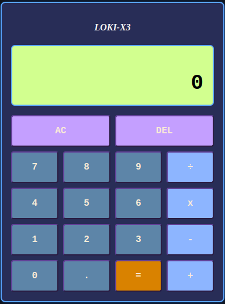
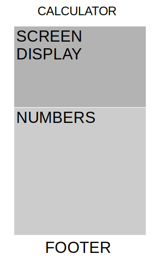
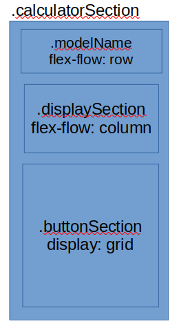
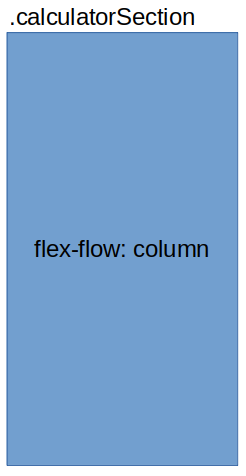
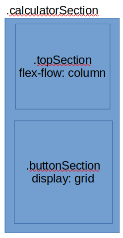

<h1 align="center">Part of<br>
<svg xmlns="http://www.w3.org/2000/svg" width="205" height="59" viewBox="0 0 205 59" fill="none" role="img" aria-labelledby="a68i8g4g8a05x1fs089a4mwee9l60mwy" class="hidden lg:block h-15 w-auto text-gray-800"><title id="a68i8g4g8a05x1fs089a4mwee9l60mwy">Odin Logo</title>
<path fill-rule="evenodd" clip-rule="evenodd" d="M8.68945 34.7331L13.1482 19.2902H30.9833L35.442 34.7331H8.68945Z" fill="#EED9C3" data-darkreader-inline-fill="" style="--darkreader-inline-fill:#e8cbad;"></path>
<ellipse cx="27.7849" cy="27.1223" rx="1.26005" ry="1.24284" fill="#353535" data-darkreader-inline-fill="" style="--darkreader-inline-fill:#c7c2ba;"></ellipse>
<path fill-rule="evenodd" clip-rule="evenodd" d="M19.446 25.7092C19.446 25.2752 19.0891 24.9233 18.6493 24.9233C17.638 24.9233 15.9034 24.9233 14.8922 24.9233C14.4523 24.9233 14.0955 25.2752 14.0955 25.7092C14.0955 26.3856 14.0955 27.3716 14.0955 28.1426C14.0955 28.7935 14.6305 29.3212 15.2902 29.3212C15.6995 29.3212 16.1763 29.3212 16.6578 29.3212C17.3973 29.3212 18.1062 29.0314 18.6295 28.5155C19.1522 28.0001 19.446 27.3004 19.446 26.5712C19.446 26.2585 19.446 25.9621 19.446 25.7092Z" fill="#A78347" data-darkreader-inline-fill="" style="--darkreader-inline-fill:#be9d66;"></path>
<path fill-rule="evenodd" clip-rule="evenodd" d="M35.0004 4.5308L43.8517 0L39.0002 18L35.0002 22L35.0004 4.5308Z" fill="#E3B261" data-darkreader-inline-fill="" style="--darkreader-inline-fill:#e4b465;"></path>
<path fill-rule="evenodd" clip-rule="evenodd" d="M8.8514 4.5308L0.000132561 0L4.85156 18L8.85156 22L8.8514 4.5308Z" fill="#E3B261" data-darkreader-inline-fill="" style="--darkreader-inline-fill:#e4b465;"></path>
<path fill-rule="evenodd" clip-rule="evenodd" d="M35.442 12.7438C35.442 12.7438 28.7539 8.34589 22.0657 8.34589C15.3776 8.34589 8.68945 12.7438 8.68945 12.7438V25.9373L10.473 29.4556C11.7527 24.5929 17.5445 22.5672 21.576 25.5723L22.0657 25.9373L22.5554 25.5723C26.587 22.5672 32.3788 24.5929 33.6585 29.4556L35.442 25.9373V12.7438Z" fill="#E3B261" data-darkreader-inline-fill="" style="--darkreader-inline-fill:#e4b465;"></path>
<path fill-rule="evenodd" clip-rule="evenodd" d="M17.6068 32.5341L14.0398 53.2041L9.12134 49.6858L13.148 34.7331L17.6068 32.5341Z" fill="#D4D4D4" data-darkreader-inline-fill="" style="--darkreader-inline-fill:#cdc8c2;"></path>
<path fill-rule="evenodd" clip-rule="evenodd" d="M26.5243 32.5341L30.0913 53.2041L35.0098 49.6858L30.9831 34.7331L26.5243 32.5341Z" fill="#D5D5D5" data-darkreader-inline-fill="" style="--darkreader-inline-fill:#cdc9c3;"></path>
<path fill-rule="evenodd" clip-rule="evenodd" d="M8.68933 25.9373L5.12231 39.1309L9.58108 47.9267L13.1481 34.7331L8.68933 25.9373Z" fill="#E6E6E6" data-darkreader-inline-fill="" style="--darkreader-inline-fill:#d8d5d0;"></path>
<path fill-rule="evenodd" clip-rule="evenodd" d="M35.4418 25.9373L39.0088 39.1309L34.55 47.9267L30.983 34.7331L35.4418 25.9373Z" fill="#E6E6E6" data-darkreader-inline-fill="" style="--darkreader-inline-fill:#d8d5d0;"></path>
<path fill-rule="evenodd" clip-rule="evenodd" d="M17.6069 32.5341L13.594 54.0837L22.0656 58.4815L30.5373 54.0837L26.5244 32.5341L22.3983 30.4992L22.0656 30.3352L17.6069 32.5341Z" fill="#E6E6E6" data-darkreader-inline-fill="" style="--darkreader-inline-fill:#d8d5d0;"></path>
<path fill-rule="evenodd" clip-rule="evenodd" d="M23.6636 33.4137H20.5425C20.5425 33.4137 20.5425 33.9348 20.5425 34.514C20.5425 34.9222 20.707 35.3131 20.9995 35.6016C21.292 35.8901 21.6884 36.0524 22.1022 36.0524C22.1026 36.0524 22.1035 36.0524 22.1039 36.0524C22.5177 36.0524 22.9141 35.8901 23.2066 35.6016C23.4991 35.3131 23.6636 34.9222 23.6636 34.514C23.6636 33.9348 23.6636 33.4137 23.6636 33.4137Z" fill="#353535" data-darkreader-inline-fill="" style="--darkreader-inline-fill:#c7c2ba;"></path>
<path d="M68.808 20.384L67.704 20.456C67.368 20.456 67.056 20.456 66.696 20.432C66.504 20.432 66.288 20.6 66.144 20.6L65.688 20.408L63.36 20.288L63.288 22.256L63.576 22.544L65.04 22.496C65.112 22.496 65.256 22.472 65.424 22.424L65.544 22.304L66.072 22.376L66.216 23.36L66.12 24.896L66.264 26.024L66.144 30.92L66.024 34.304L66.24 34.544L65.88 36.056V37.904L67.152 38.096L67.824 37.976L68.52 37.592L68.328 35.888V31.376L68.04 30.92L68.064 30.896L68.28 29.456L68.256 27.608V27.2C68.256 27.032 68.232 26.816 68.232 26.624C68.208 26.48 68.208 25.88 68.208 25.664L68.256 23.888L68.16 23.36L68.304 22.352H69.048L69.768 22.4L70.008 22.472H71.088L71.16 21.344L71.016 20.336L68.808 20.384ZM73.2638 33.992L73.3118 35.504L73.6478 35.864L73.2638 36.32L73.1918 37.928L74.7038 38.072L75.6878 38.024L75.7118 37.136L75.6398 36.056L75.4958 34.784L75.5198 34.712L75.6398 30.536L77.5118 29.744H77.5358L78.9278 29.432L78.9038 29.864L78.9758 30.2L78.9278 33.896L79.2878 34.28L79.0478 34.496L78.8798 37.184L79.1918 38.024H80.5838L81.4718 37.976L81.4238 36.656L81.2558 36.056L81.2078 32.984L81.1598 28.688L81.1118 28.208L81.0398 27.128L81.1598 24.872L80.9438 24.176L81.1838 23.864L81.2078 22.952V22.976L81.3518 21.608L81.4238 20.408L80.0558 20.36L79.1678 20.336L78.8078 21.032L78.9278 21.992L78.9758 24.152L79.0478 26.336L78.9518 26.984L78.6878 27.104L78.2318 27.32L77.2478 27.752L77.0318 28.016L76.6478 27.872L75.6398 28.232L75.5918 28.256L75.3758 25.928L75.4718 24.344L75.2078 24.128L75.4958 23.672L75.6158 22.208L75.7118 20.48L73.6478 20.216L73.0718 20.6L73.2398 22.088L73.1678 22.568L73.2398 24.152L73.4078 25.64L73.3118 27.992L73.4798 30.704L73.2638 33.992ZM90.8258 22.616L90.8738 21.272L90.8498 20.336L88.4738 20.36L87.5378 20.552L87.2018 20.36H85.8338L84.7058 20.504L84.8258 22.208L85.0898 22.52L84.8258 22.928L84.8498 24.152L84.8258 26.024V27.8L84.7538 28.688L84.9458 31.064L84.8498 31.256L84.8738 32.552V33.104L85.0898 33.392L84.8018 34.016L84.7778 35.12L84.8018 35.384L84.6578 37.016L84.7778 38L86.5778 38.024L86.7698 37.904H87.6098L88.9778 38.048L90.5618 38.072L91.1138 37.832L91.2098 36.944L91.2578 35.744L90.0578 35.72L89.4578 35.912L87.5378 35.936L87.3458 35.888L87.1298 35.84L87.0818 33.512L87.0578 33.464L87.1298 33.248L86.9858 32.552L87.0818 30.08H87.4658L88.9778 30.128L90.1538 30.176L90.2018 29.192L90.3458 28.472L90.0338 27.872L88.8098 27.992L87.8738 28.04L86.9858 27.992L86.9378 27.056L86.6978 26.864L86.9618 26.432L87.0818 25.712V23.336L87.1298 22.736V22.472H87.3458L88.6658 22.52L89.0498 22.448L89.1218 22.424L89.6978 22.616H90.8258ZM102.331 20.312L102.115 20.336H101.227L101.179 20.504L101.035 21.224L100.939 21.368L99.6429 24.608L99.7629 24.872L99.3309 25.184L98.0349 28.328L97.8429 28.448L97.8909 29.96L98.4669 31.184L99.3309 33.224L100.051 34.712H100.315L100.243 35.12L101.083 37.208L101.107 38L103.291 38.024L103.339 37.76L103.627 36.992L104.923 33.92L105.475 32.768L105.499 32.384L105.691 32.144L106.867 29.768L106.939 28.448L106.123 26.672L105.475 25.232H105.235L105.115 24.584L103.891 21.584L103.411 20.264L102.331 20.312ZM102.379 34.952L101.323 32.192L100.843 31.208L100.363 30.872L100.603 30.584L100.387 29.888L100.075 29.096L100.051 28.808L100.843 26.744L100.675 26.36L101.011 26.264L102.331 22.784L102.475 23.24L103.027 24.704L103.459 24.968L103.243 25.256L104.179 27.68L104.467 28.496L104.659 29.096L103.483 31.976L103.507 32.408H103.531L103.243 32.696L102.475 35.216L102.379 34.952ZM113.227 35.72L114.067 34.016L116.539 30.224L116.971 29.504L116.947 27.752L116.515 27.2L116.539 27.248L114.715 24.824L114.091 23.72L113.251 22.88L112.987 22.088L111.499 20.048L110.227 20.432L109.195 20.744L109.219 21.632L109.291 22.88L109.531 23.192L109.291 23.648L109.315 29.936L109.459 30.872L109.315 36.248V36.224L109.267 37.832L110.827 38.048L111.619 38.264L113.227 35.72ZM111.451 26.744L111.379 23.264L111.523 23.432L113.899 27.248L114.379 27.632L114.475 28.208L114.907 28.856L114.475 29.552L113.683 30.872L112.675 32.816L112.867 33.032L112.435 33.248L111.379 34.952L111.355 35L111.379 33.704L111.475 28.952L111.091 27.824L111.451 26.744ZM119.431 27.56L119.359 28.88L119.287 29.624V34.112V34.976L119.575 35.384L119.287 35.864L118.951 38L120.055 38.024L120.559 38.048L121.615 37.712L121.639 36.824L121.591 36.368L121.543 36.008V29.36L121.279 29.192L121.495 28.688L121.447 28.088L121.351 27.152L121.423 25.928L121.495 22.784L121.615 22.184L121.735 20.432L120.175 20.336L119.047 20.408L119.167 21.608L119.383 21.728L119.191 22.16L119.263 26.96L119.431 27.56ZM133.115 35.888V35.12L132.947 29.864L132.683 29.072L132.875 28.064L133.115 22.16L133.163 20.528L132.179 20.36L130.787 20.384V22.304L131.027 22.64L130.787 23.384V25.448L129.995 24.152L129.803 24.056L129.203 23.096L127.043 20.12L125.147 20.648V21.896L125.243 24.392L125.339 25.76L125.243 30.752L125.459 31.232L125.267 31.928L125.123 35.336V35.744L125.195 35.96L125.027 37.88L126.059 38.072L127.475 38.024L127.523 36.488L127.451 36.152L127.475 33.656L127.259 32.744L127.379 31.88L127.427 26.408L127.139 26.096L127.115 26.048L127.451 25.184V23.888L128.075 24.752L129.059 26.12L129.755 26.96L130.091 27.488L130.427 27.848L130.811 28.496L130.835 30.992L130.907 31.448L130.835 31.568L130.811 33.872L130.835 36.152L130.811 38.024L131.627 38.072L132.947 38.048L133.259 37.232L133.115 35.888ZM147.393 28.76L148.161 28.016L148.905 27.104L148.953 25.448L146.457 22.808L145.953 22.64L145.857 22.232L143.697 20L142.929 20.288L141.777 20.792L141.825 22.4L141.945 23.384V27.32L141.897 27.44L141.873 33.44L142.161 33.752L141.945 34.496L141.681 37.928L143.073 38.072L144.273 38L144.129 35.024L143.745 34.688L144.129 34.112L144.081 32.456L144.297 32.216L145.905 30.392L147.393 28.76ZM144.105 27.128L143.841 26.648L144.081 25.904L144.057 24.752L144.081 23.048L145.473 24.608L145.689 24.752L145.857 25.088L146.889 26.24L146.505 26.792L146.265 27.392L146.001 27.32L144.801 28.736L144.105 29.48V27.128ZM153.466 30.608L154.426 32.552L154.642 33.104L155.53 34.784L155.818 34.928L155.794 35.336L156.634 37.256L157.21 38.192L159.154 37.112L159.178 36.416L158.386 35.576L157.954 34.664V34.688L157.618 33.992L157.474 33.92V33.608L156.514 31.976C156.346 31.736 156.202 31.616 156.01 31.4V30.992C155.866 30.704 155.578 30.296 155.41 29.96L156.082 29.048L156.49 28.544L157.258 27.632L158.362 26.288L158.53 24.848L157.378 23.792C157.354 23.792 156.97 23.912 156.946 23.888L156.802 23.288L152.986 19.976L151.09 20.744L151.186 22.808L151.306 27.392L151.114 27.872L151.162 29.12L151.258 31.928V32.864L151.474 33.176L151.114 34.112L150.97 37.928L152.554 38.072L153.514 37.688L153.49 35.696L153.418 35.48L153.346 33.08L153.322 30.464L153.466 30.608ZM153.37 28.352L153.274 26.216L153.226 25.952L153.178 25.808L153.082 25.376L153.274 24.92V24.68L153.322 22.832L155.53 25.016L155.698 25.136L156.178 25.736L155.914 26.072C155.602 26.504 155.026 27.248 154.69 27.656L153.49 29.144L153.322 29.24L153.37 28.352ZM164.323 20.312L164.107 20.336H163.219L163.171 20.504L163.027 21.224L162.931 21.368L161.635 24.608L161.755 24.872L161.323 25.184L160.027 28.328L159.835 28.448L159.883 29.96L160.459 31.184L161.323 33.224L162.043 34.712H162.307L162.235 35.12L163.075 37.208L163.099 38L165.283 38.024L165.331 37.76L165.619 36.992L166.915 33.92L167.467 32.768L167.491 32.384L167.683 32.144L168.859 29.768L168.931 28.448L168.115 26.672L167.467 25.232H167.227L167.107 24.584L165.883 21.584L165.403 20.264L164.323 20.312ZM164.371 34.952L163.315 32.192L162.835 31.208L162.355 30.872L162.595 30.584L162.379 29.888L162.067 29.096L162.043 28.808L162.835 26.744L162.667 26.36L163.003 26.264L164.323 22.784L164.467 23.24L165.019 24.704L165.451 24.968L165.235 25.256L166.171 27.68L166.459 28.496L166.651 29.096L165.475 31.976L165.499 32.408H165.523L165.235 32.696L164.467 35.216L164.371 34.952ZM171.71 27.608L171.59 28.928L171.614 30.416L171.638 30.752V31.688L171.542 34.304L171.59 34.52L171.23 35.024L170.174 35.72L169.118 36.152V37.4L170.438 38.384L172.214 36.944L172.19 36.464L172.838 36.368L173.606 35.696L173.99 35.024L173.702 30.896L173.51 30.176L173.774 29.984L173.678 23.288L173.966 21.176L173.654 20.336L171.374 20.384V21.728L171.806 21.968L171.494 22.352L171.566 26.408L171.71 27.608ZM183.502 22.616L183.55 21.272L183.526 20.336L181.15 20.36L180.214 20.552L179.878 20.36H178.51L177.382 20.504L177.502 22.208L177.766 22.52L177.502 22.928L177.526 24.152L177.502 26.024V27.8L177.43 28.688L177.622 31.064L177.526 31.256L177.55 32.552V33.104L177.766 33.392L177.478 34.016L177.454 35.12L177.478 35.384L177.334 37.016L177.454 38L179.254 38.024L179.446 37.904H180.286L181.654 38.048L183.238 38.072L183.79 37.832L183.886 36.944L183.934 35.744L182.734 35.72L182.134 35.912L180.214 35.936L180.022 35.888L179.806 35.84L179.758 33.512L179.734 33.464L179.806 33.248L179.662 32.552L179.758 30.08H180.142L181.654 30.128L182.83 30.176L182.878 29.192L183.022 28.472L182.71 27.872L181.486 27.992L180.55 28.04L179.662 27.992L179.614 27.056L179.374 26.864L179.638 26.432L179.758 25.712V23.336L179.806 22.736V22.472H180.022L181.342 22.52L181.726 22.448L181.798 22.424L182.374 22.616H183.502ZM185.362 30.896L186.226 32.456L187.33 33.488L187.138 33.92L188.962 36.752L189.01 37.04L189.826 38.312L190.642 37.784L191.89 36.752L191.338 35.864L190.09 34.232L188.986 32.36L188.098 30.992L187.882 30.512L187.546 30.176L187.306 29.72L186.946 29.024L187.258 28.448L187.714 27.632L188.506 26.384L189.946 24.248L190.066 23.6L190.474 23.336L191.146 22.4L191.818 21.2L190.018 20L189.178 20.984L189.154 21.176L187.81 23.384V23.48L187.21 24.44V25.016L186.346 25.856L184.786 28.496L184.81 30.032L185.362 30.896ZM198.12 20.384L197.016 20.456C196.68 20.456 196.368 20.456 196.008 20.432C195.816 20.432 195.6 20.6 195.456 20.6L195 20.408L192.672 20.288L192.6 22.256L192.888 22.544L194.352 22.496C194.424 22.496 194.568 22.472 194.736 22.424L194.856 22.304L195.384 22.376L195.528 23.36L195.432 24.896L195.576 26.024L195.456 30.92L195.336 34.304L195.552 34.544L195.192 36.056V37.904L196.464 38.096L197.136 37.976L197.832 37.592L197.64 35.888V31.376L197.352 30.92L197.376 30.896L197.592 29.456L197.568 27.608V27.2C197.568 27.032 197.544 26.816 197.544 26.624C197.52 26.48 197.52 25.88 197.52 25.664L197.568 23.888L197.472 23.36L197.616 22.352H198.36L199.08 22.4L199.32 22.472H200.4L200.472 21.344L200.328 20.336L198.12 20.384Z" fill="currentColor" data-darkreader-inline-fill="" style="--darkreader-inline-fill:currentColor;"></path>
</svg><br>
<svg xmlns="http://www.w3.org/2000/svg" width="25%" height="25%" viewBox="0 0 104 104" fill="none" class="bg-white odin-dark-bg">
<circle cx="52" cy="52" r="50" stroke="url(#paint0_linear)" stroke-width="2.5"></circle>
<circle cx="52" cy="52" r="28.2475" stroke="url(#paint1_linear)" stroke-width="1.5"></circle>
<path d="M57 87L52 92L47 87" stroke="url(#paint2_linear)" stroke-width="1.5"></path>
<path fill-rule="evenodd" clip-rule="evenodd" d="M52 44.495C52 41.3885 60.2695 38.873 69.67 38.873V65.3775C60.2695 65.3775 52 67.8935 52 71C52 67.8935 43.729 65.3775 34.33 65.3775V38.873C43.729 38.873 52 41.3885 52 44.495Z" stroke="url(#paint3_linear)" stroke-width="1.5"></path>
<path d="M52 44.495V70.799" stroke="url(#paint4_linear)" stroke-width="1.5"></path>
<path d="M47.984 48.0935C45.398 47.1025 41.74 46.386 37.543 46.1015" stroke="url(#paint5_linear)" stroke-width="1.5"></path>
<path d="M47.984 52.9125C45.398 51.9215 41.74 51.205 37.543 50.921" stroke="url(#paint6_linear)" stroke-width="1.5"></path>
<path d="M47.984 57.732C45.398 56.7405 41.74 56.024 37.543 55.74" stroke="url(#paint7_linear)" stroke-width="1.5"></path>
<path d="M47.984 62.551C45.398 61.5595 41.74 60.8435 37.543 60.559" stroke="url(#paint8_linear)" stroke-width="1.5"></path>
<path d="M56.016 57.732C58.6035 56.7405 62.26 56.024 66.457 55.74" stroke="url(#paint9_linear)" stroke-width="1.5"></path>
<path d="M56.016 62.551C58.6035 61.5595 62.26 60.8435 66.457 60.559" stroke="url(#paint10_linear)" stroke-width="1.5"></path>
<path d="M66.457 38.873V52.527L63.2445 49.314L60.032 52.527V39.676" stroke="url(#paint11_linear)" stroke-width="1.5"></path>
<path d="M13.972 45.9108L15.3472 46.2978L15.6358 46.1823L16.1723 46.5184L17.758 46.9869L18.0941 46.0463L18.2027 45.4962L17.5372 45.3299L17.3301 45.3503L16.9158 45.2179L16.3318 45.1296L15.724 45.021L14.5865 44.7223L14.0058 44.6205L13.7478 44.556L14.0397 43.5034L14.0159 43.4253L14.1653 43.2317L14.2807 42.7699L13.8597 42.5492L13.5303 42.4236L12.9395 42.3625L12.7766 43.2454L12.729 43.4355L12.5593 44.2301L10.8683 43.8364L10.6137 43.9892L10.5593 43.8024L9.90059 43.6089L9.42182 43.446L9.44558 43.3509L9.45235 43.1506L9.544 42.6684L9.88009 41.901L9.99889 41.3679L9.41824 41.0929L8.72555 40.9198L8.37592 42.3765L8.50157 42.5666L8.27749 42.8858L8.0229 43.789L7.86336 44.4851L8.72923 44.6582L9.38797 44.8517L9.65281 44.8313L9.73431 44.8517L12.084 45.3812L12.1859 45.4355L12.4983 45.5136L13.972 45.9108Z" fill="url(#paint12_diamond)"></path>
<path d="M12.9166 31.2926L12.8654 31.4086L12.6053 31.8565L12.6759 31.9299L12.9969 32.2135L13.0415 32.3041L14.2962 33.907L14.4645 33.9238L14.4953 34.2332L15.7016 35.808L15.7059 35.94L16.4826 36.3587L17.2688 36.4267L18.551 36.5885L19.5125 36.6613L19.5898 36.5281L19.7746 36.6839L21.0739 36.8719L21.4804 37.0918L22.1324 35.9972L22.0133 35.8956L21.7102 35.5253L20.5403 33.9716L20.1209 33.3557L19.9342 33.2311L19.8694 33.0639L19.0154 31.7747L18.3706 31.3516L17.2357 31.243L16.3195 31.148L16.2491 31.269L15.8871 31.1397L14.0152 30.8783L13.2088 30.7337L12.9166 31.2926ZM20.3156 35.5572L18.614 35.2814L17.977 35.2352L17.6669 35.3789L17.5919 35.1735L17.1775 35.0785L16.6866 35.0039L16.5343 34.9316L15.7252 33.9275L15.4823 33.8997L15.5323 33.7021L14.1635 32.0168L14.4357 32.0777L15.336 32.2282L15.5957 32.0876L15.6777 32.2809L17.1746 32.5189L17.6706 32.6127L18.0295 32.6916L19.1378 34.1285L19.3627 34.243L19.3698 34.2309L19.4307 34.4605L20.4769 35.5862L20.3156 35.5572Z" fill="url(#paint13_diamond)"></path>
<path d="M25.2021 27.8807L25.4092 27.9008L25.4333 28.2191L25.8442 28.7347L26.3249 29.2439L27.4361 29.2188L28.0989 28.6367L28.2709 28.1594L28.6922 27.0402L28.7788 27.094L29.3696 27.5788L30.2251 26.5006L29.3463 25.8233L28.1837 24.6664L26.1166 22.3453L25.792 22.0916L25.5942 22.082L25.5381 21.8116L25.4168 21.657L24.9202 21.0678L24.3815 20.3279L24.1743 20.3079L24.232 20.1422L23.7552 19.554L23.2322 19.1023L22.7457 19.5245L22.2366 20.0051L22.8836 20.7602L24.1101 22.0293L24.8907 22.8901L26.1003 24.0988L27.2637 25.4441L27.8335 26.1558L27.3123 27.29L27.0829 27.7248L26.9905 27.7897L26.7918 27.7998L26.6404 27.6536L25.4674 26.5061L24.4302 25.2166L23.7041 24.4576L23.3458 24.0833L23.0156 23.7401L22.7308 23.2802L22.4202 23.1461L22.2406 22.9688L22.0057 22.5014L21.7358 22.1413L20.9092 21.209L19.957 22.0347L20.1702 22.5406L21.7466 24.1539L22.09 24.4283L22.2045 24.7213L22.8619 25.4671L23.9596 26.5316L25.2021 27.8807Z" fill="url(#paint14_diamond)"></path>
<path d="M39.3739 20.0371L39.1932 19.6271L37.8668 16.8611L37.5396 16.5005L37.4049 15.9173L36.1438 12.7094L35.7855 11.827L35.2207 11.9688L34.4833 12.3091L34.9351 13.334L35.1423 13.4569L35.1892 13.9105L35.6749 15.0122L34.9472 14.5068L34.8221 14.5007L34.2759 14.1294L32.4228 13.0492L31.535 13.7771L31.8286 14.4433L32.4671 15.753L32.8403 16.4606L33.9636 19.1478L34.1918 19.3532L34.2531 19.7699L34.9781 21.6228L35.0741 21.8406L35.1633 21.939L35.5254 23.0034L36.1215 22.863L36.866 22.5042L36.5302 21.6731L36.4127 21.5107L35.8382 20.1727L35.5084 19.7367L35.3691 19.2473L34.1072 16.3152L33.8801 16.2164L33.856 16.1964L33.8321 15.6562L33.5271 14.9644L34.0635 15.2788L34.9106 15.7775L35.4798 16.0621L35.7833 16.2649L36.0474 16.378L36.4048 16.6335L37.0049 17.9601L37.1506 18.1866L37.1404 18.2676L37.6697 19.5031L38.219 20.7144L38.6467 21.7193L39.0935 21.5529L39.7925 21.2295L39.767 20.7206L39.3739 20.0371Z" fill="url(#paint15_diamond)"></path>
<path d="M48.4054 17.8959L48.7863 16.8552L49.9835 14.5016L50.1892 14.0571L50.0659 13.0425L49.781 12.7493L49.7979 12.7756L48.5888 11.4835L48.158 10.8821L47.6184 10.4473L47.4159 10.0044L46.4256 8.91408L45.7118 9.21614L45.1327 9.46147L45.202 9.975L45.3216 10.6943L45.4803 10.8603L45.3695 11.1398L45.7757 14.7852L45.9176 15.3191L46.1695 18.4461L46.168 18.4322L46.2404 19.3678L47.1587 19.3958L47.6315 19.4717L48.4054 17.8959ZM46.8154 12.8007L46.5566 10.7868L46.6506 10.8753L48.2667 12.9403L48.569 13.1331L48.6607 13.4611L48.9516 13.81L48.7445 14.2406L48.3675 15.0556L47.9041 16.246L48.029 16.3593L47.7919 16.5115L47.2857 17.5657L47.2748 17.595L47.2079 16.8419L46.9671 14.0798L46.674 13.4495L46.8154 12.8007Z" fill="url(#paint16_diamond)"></path>
<path d="M59.9303 17.0062L59.9543 17.481L60.0624 17.587L59.9263 17.7037L59.9082 18.0993L59.7582 19.8663L59.9685 20.0344L60.1474 20.0684L61.2278 19.9314L61.1887 19.3112L61.0242 19.052L61.1276 18.9576L61.1544 18.065L61.0533 16.7205L61.0898 16.528L61.0585 13.0878L60.9169 12.9327L61.0602 12.7034L61.0193 10.5155L60.9904 10.3675L60.97 10.2496L61.0751 9.77081L60.8622 9.6164L59.7238 9.45743L59.4219 10.2979L59.1885 10.8521L58.9878 11.384L59.1 11.619L58.7976 11.8609L58.0353 13.6257L57.9883 13.8733L57.851 14.1465L57.7601 14.4L57.164 16.0396L57.1256 16.3173L56.9456 16.4399L56.6436 17.2804L55.9539 18.888L56.3779 19.2819L57.215 19.5263L57.5412 18.6334L57.5179 18.23L57.6704 18.1022L58.007 17.1543L58.303 17.0965L58.4372 17.0649L59.4005 17.0197L59.7122 16.8793L59.7259 16.8819L59.9237 16.891L59.9303 17.0062ZM59.2625 13.6163L59.2355 13.3832L59.3861 13.3405L59.9796 11.7147L59.9093 13.2118L59.9173 13.4698L59.8366 14.1955L59.8299 15.7332L59.4265 15.7564L58.4802 15.8619L58.5123 15.7682L58.8469 14.9055L58.8306 14.9166L59.2625 13.6163Z" fill="url(#paint17_diamond)"></path>
<path d="M73.1836 14.0374L72.59 13.784C72.4152 13.6954 72.2528 13.6132 72.0718 13.5058C71.9719 13.4552 71.8152 13.4857 71.7403 13.4478L71.5535 13.2277L70.3737 12.5518L69.8175 13.5569L69.8915 13.7827L70.6661 14.1436C70.7035 14.1625 70.7848 14.188 70.8849 14.2073L70.9789 14.1765L71.2347 14.3531L71.0504 14.9031L70.5956 15.6772L70.3733 16.3021L69.0206 18.8184L68.0663 20.5479L68.1155 20.7297L67.5297 21.4217L67.0427 22.3834L67.654 22.8186L68.0354 22.9332L68.4988 22.9168L68.8479 21.9794L70.037 19.6313L70.0073 19.3181L70.0261 19.3119L70.518 18.6195L70.9925 17.6514L71.1 17.4391C71.1443 17.3517 71.1887 17.2329 71.2393 17.133C71.2648 17.0517 71.4229 16.7395 71.4799 16.6271L71.9729 15.7155L72.0621 15.4154L72.4026 14.9288L72.7898 15.1249L73.1519 15.3396L73.2578 15.4403L73.8198 15.7249L74.1546 15.1569L74.3453 14.5943L73.1836 14.0374Z" fill="url(#paint18_diamond)"></path>
<path d="M78.4669 22.6457L77.9259 23.1952L77.6072 23.4928L75.8746 25.4554L75.541 25.8333L75.5095 26.1229L75.1982 26.2216L74.2267 27.026L74.7002 27.4627L74.9113 27.6678L75.5029 27.9285L75.8562 27.5494L76.0112 27.3315L76.1292 27.1555L78.6957 24.2482L78.6451 24.0729L78.9341 23.9358L79.1447 23.6549L79.4641 23.2085L79.9681 22.701L81.2133 21.3539L81.4974 21.1379L82.2263 20.418L81.5811 19.7738L81.06 19.3698L80.6492 19.9409L80.6974 20.0768L80.4466 20.1916L78.6251 22.3185L78.4669 22.6457Z" fill="url(#paint19_diamond)"></path>
<path d="M89.7305 29.0609L89.6498 28.9631L89.366 28.5298L89.2687 28.56L88.8713 28.7198L88.7704 28.719L86.775 29.1218L86.6845 29.2648L86.3942 29.1536L84.4457 29.5258L84.3258 29.4705L83.6033 29.977L83.19 30.6493L82.4705 31.7228L81.9744 32.5496L82.0588 32.6785L81.8366 32.7737L81.0861 33.8509L80.7072 34.1157L81.3934 35.1892L81.5376 35.1283L82.0044 35.0234L83.9178 34.6742L84.6563 34.5755L84.8514 34.4645L85.0299 34.4815L86.5652 34.2962L87.2324 33.9095L87.8384 32.9438L88.3341 32.1674L88.2574 32.0503L88.5353 31.7846L89.6082 30.2287L90.0991 29.5726L89.7305 29.0609ZM82.6012 33.7625L83.6107 32.3652L83.9375 31.8165L83.9481 31.4749L84.1654 31.5L84.436 31.1721L84.7228 30.7668L84.8557 30.663L86.1161 30.39L86.2498 30.1853L86.404 30.3186L88.5241 29.8508L88.3476 30.0668L87.8095 30.804L87.8187 31.0992L87.6092 31.0858L86.7253 32.3172L86.4191 32.7185L86.1876 33.0039L84.4063 33.3503L84.2032 33.5L84.2108 33.5117L83.9783 33.4632L82.503 33.8937L82.6012 33.7625Z" fill="url(#paint20_diamond)"></path>
<path d="M87.3144 46.2109L87.746 46.0907L90.6732 45.1735L91.077 44.9011L91.6735 44.8512L95.0287 44.0619L95.9533 43.8334L95.8937 43.2541L95.6623 42.4756L94.5834 42.7762L94.4321 42.9637L93.9765 42.9453L92.8166 43.2684L93.4209 42.6204L93.4448 42.4975L93.8903 42.0101L95.2245 40.3304L94.631 39.3477L93.9297 39.543L92.5422 39.9877L91.7885 40.2558L88.9682 40.9833L88.7323 41.1798L88.3112 41.1809L86.3735 41.6335L86.1443 41.6973L86.0342 41.7716L84.929 41.9778L84.9826 42.5877L85.2312 43.3759L86.1019 43.1625L86.2794 43.0694L87.6858 42.6922L88.1645 42.428L88.6688 42.3602L91.7512 41.5306L91.8814 41.3199L91.9046 41.2989L92.4428 41.3524L93.171 41.1496L92.7832 41.6355L92.1685 42.4026L91.8054 42.9252L91.5613 43.1966L91.4116 43.4418L91.1076 43.759L89.7088 44.1632L89.4638 44.2751L89.3851 44.2534L88.0866 44.6006L86.8092 44.971L85.7535 45.2506L85.8542 45.7166L86.0744 46.4546L86.5817 46.5022L87.3144 46.2109Z" fill="url(#paint21_diamond)"></path>
<defs>
<linearGradient id="paint1_linear" x1="-95.1857" y1="61.9116" x2="63.3983" y2="220.496" gradientUnits="userSpaceOnUse">
<stop stop-color="#CE973D" data-darkreader-inline-stopcolor="" style="--darkreader-inline-stopcolor:#9d7128;"></stop>
<stop offset="0.43" stop-color="#D59E6F" data-darkreader-inline-stopcolor="" style="--darkreader-inline-stopcolor:#7e4e25;"></stop>
<stop offset="1" stop-color="#E4ADDF" data-darkreader-inline-stopcolor="" style="--darkreader-inline-stopcolor:#581d52;"></stop>
</linearGradient>
<linearGradient id="paint2_linear" x1="78.6175" y1="112" x2="78.6175" y2="84.5" gradientUnits="userSpaceOnUse">
<stop stop-color="#A78347" data-darkreader-inline-stopcolor="" style="--darkreader-inline-stopcolor:#866939;"></stop>
<stop offset="1" stop-color="#CE978E" data-darkreader-inline-stopcolor="" style="--darkreader-inline-stopcolor:#67352d;"></stop>
</linearGradient>
<linearGradient id="paint3_linear" x1="-10.1128" y1="60.3198" x2="45.7291" y2="122.576" gradientUnits="userSpaceOnUse">
<stop stop-color="#CE973D" data-darkreader-inline-stopcolor="" style="--darkreader-inline-stopcolor:#9d7128;"></stop>
<stop offset="0.339664" stop-color="#D59E6F" data-darkreader-inline-stopcolor="" style="--darkreader-inline-stopcolor:#7e4e25;"></stop>
<stop offset="1" stop-color="#F89D8B" data-darkreader-inline-stopcolor="" style="--darkreader-inline-stopcolor:#761907;"></stop>
</linearGradient>
<linearGradient id="paint4_linear" x1="50.1136" y1="62.0546" x2="55.4122" y2="62.3608" gradientUnits="userSpaceOnUse">
<stop stop-color="#CE973D" data-darkreader-inline-stopcolor="" style="--darkreader-inline-stopcolor:#9d7128;"></stop>
<stop offset="0.339664" stop-color="#D59E6F" data-darkreader-inline-stopcolor="" style="--darkreader-inline-stopcolor:#7e4e25;"></stop>
<stop offset="1" stop-color="#F89D8B" data-darkreader-inline-stopcolor="" style="--darkreader-inline-stopcolor:#761907;"></stop>
</linearGradient>
<linearGradient id="paint5_linear" x1="24.4127" y1="47.4313" x2="25.679" y2="54.1587" gradientUnits="userSpaceOnUse">
<stop stop-color="#CE973D" data-darkreader-inline-stopcolor="" style="--darkreader-inline-stopcolor:#9d7128;"></stop>
<stop offset="0.339664" stop-color="#D59E6F" data-darkreader-inline-stopcolor="" style="--darkreader-inline-stopcolor:#7e4e25;"></stop>
<stop offset="1" stop-color="#F89D8B" data-darkreader-inline-stopcolor="" style="--darkreader-inline-stopcolor:#761907;"></stop>
</linearGradient>
<linearGradient id="paint6_linear" x1="24.4127" y1="52.2504" x2="25.6784" y2="58.9763" gradientUnits="userSpaceOnUse">
<stop stop-color="#CE973D" data-darkreader-inline-stopcolor="" style="--darkreader-inline-stopcolor:#9d7128;"></stop>
<stop offset="0.339664" stop-color="#D59E6F" data-darkreader-inline-stopcolor="" style="--darkreader-inline-stopcolor:#7e4e25;"></stop>
<stop offset="1" stop-color="#F89D8B" data-darkreader-inline-stopcolor="" style="--darkreader-inline-stopcolor:#761907;"></stop>
</linearGradient>
<linearGradient id="paint7_linear" x1="24.4127" y1="57.0698" x2="25.679" y2="63.7972" gradientUnits="userSpaceOnUse">
<stop stop-color="#CE973D" data-darkreader-inline-stopcolor="" style="--darkreader-inline-stopcolor:#9d7128;"></stop>
<stop offset="0.339664" stop-color="#D59E6F" data-darkreader-inline-stopcolor="" style="--darkreader-inline-stopcolor:#7e4e25;"></stop>
<stop offset="1" stop-color="#F89D8B" data-darkreader-inline-stopcolor="" style="--darkreader-inline-stopcolor:#761907;"></stop>
</linearGradient>
<linearGradient id="paint8_linear" x1="24.4127" y1="61.8887" x2="25.679" y2="68.6162" gradientUnits="userSpaceOnUse">
<stop stop-color="#CE973D" data-darkreader-inline-stopcolor="" style="--darkreader-inline-stopcolor:#9d7128;"></stop>
<stop offset="0.339664" stop-color="#D59E6F" data-darkreader-inline-stopcolor="" style="--darkreader-inline-stopcolor:#7e4e25;"></stop>
<stop offset="1" stop-color="#F89D8B" data-darkreader-inline-stopcolor="" style="--darkreader-inline-stopcolor:#761907;"></stop>
</linearGradient>
<linearGradient id="paint9_linear" x1="42.8856" y1="57.0698" x2="44.152" y2="63.7972" gradientUnits="userSpaceOnUse">
<stop stop-color="#CE973D" data-darkreader-inline-stopcolor="" style="--darkreader-inline-stopcolor:#9d7128;"></stop>
<stop offset="0.339664" stop-color="#D59E6F" data-darkreader-inline-stopcolor="" style="--darkreader-inline-stopcolor:#7e4e25;"></stop>
<stop offset="1" stop-color="#F89D8B" data-darkreader-inline-stopcolor="" style="--darkreader-inline-stopcolor:#761907;"></stop>
</linearGradient>
<linearGradient id="paint10_linear" x1="42.8856" y1="61.8887" x2="44.152" y2="68.6162" gradientUnits="userSpaceOnUse">
<stop stop-color="#CE973D" data-darkreader-inline-stopcolor="" style="--darkreader-inline-stopcolor:#9d7128;"></stop>
<stop offset="0.339664" stop-color="#D59E6F" data-darkreader-inline-stopcolor="" style="--darkreader-inline-stopcolor:#7e4e25;"></stop>
<stop offset="1" stop-color="#F89D8B" data-darkreader-inline-stopcolor="" style="--darkreader-inline-stopcolor:#761907;"></stop>
</linearGradient>
<linearGradient id="paint11_linear" x1="51.9521" y1="47.9879" x2="70.5037" y2="56.8355" gradientUnits="userSpaceOnUse">
<stop stop-color="#CE973D" data-darkreader-inline-stopcolor="" style="--darkreader-inline-stopcolor:#9d7128;"></stop>
<stop offset="0.339664" stop-color="#D59E6F" data-darkreader-inline-stopcolor="" style="--darkreader-inline-stopcolor:#7e4e25;"></stop>
<stop offset="1" stop-color="#F89D8B" data-darkreader-inline-stopcolor="" style="--darkreader-inline-stopcolor:#761907;"></stop>
</linearGradient>
<radialGradient id="paint12_diamond" cx="0" cy="0" r="1" gradientUnits="userSpaceOnUse" gradientTransform="translate(13.2893 43.9652) rotate(14.0319) scale(5.166 1.848)">
<stop stop-color="#D49D63" data-darkreader-inline-stopcolor="" style="--darkreader-inline-stopcolor:#865625;"></stop>
<stop offset="1" stop-color="#E49E7C" data-darkreader-inline-stopcolor="" style="--darkreader-inline-stopcolor:#793819;"></stop>
</radialGradient>
<radialGradient id="paint13_diamond" cx="0" cy="0" r="1" gradientUnits="userSpaceOnUse" gradientTransform="translate(17.3893 33.8497) rotate(30.1464) scale(5.18 2.653)">
<stop stop-color="#D49D63" data-darkreader-inline-stopcolor="" style="--darkreader-inline-stopcolor:#865625;"></stop>
<stop offset="1" stop-color="#E49E7C" data-darkreader-inline-stopcolor="" style="--darkreader-inline-stopcolor:#793819;"></stop>
</radialGradient>
<radialGradient id="paint14_diamond" cx="0" cy="0" r="1" gradientUnits="userSpaceOnUse" gradientTransform="translate(25.0989 24.4117) rotate(47.7955) scale(5.215 2.394)">
<stop stop-color="#D49D63" data-darkreader-inline-stopcolor="" style="--darkreader-inline-stopcolor:#865625;"></stop>
<stop offset="1" stop-color="#E49E7C" data-darkreader-inline-stopcolor="" style="--darkreader-inline-stopcolor:#793819;"></stop>
</radialGradient>
<radialGradient id="paint15_diamond" cx="0" cy="0" r="1" gradientUnits="userSpaceOnUse" gradientTransform="translate(35.6557 17.3462) rotate(66.212) scale(5.236 2.401)">
<stop stop-color="#D49D63" data-darkreader-inline-stopcolor="" style="--darkreader-inline-stopcolor:#865625;"></stop>
<stop offset="1" stop-color="#E49E7C" data-darkreader-inline-stopcolor="" style="--darkreader-inline-stopcolor:#793819;"></stop>
</radialGradient>
<radialGradient id="paint16_diamond" cx="0" cy="0" r="1" gradientUnits="userSpaceOnUse" gradientTransform="translate(47.9125 14.0978) rotate(83.8612) scale(5.313 2.268)">
<stop stop-color="#D49D63" data-darkreader-inline-stopcolor="" style="--darkreader-inline-stopcolor:#865625;"></stop>
<stop offset="1" stop-color="#E49E7C" data-darkreader-inline-stopcolor="" style="--darkreader-inline-stopcolor:#793819;"></stop>
</radialGradient>
<radialGradient id="paint17_diamond" cx="0" cy="0" r="1" gradientUnits="userSpaceOnUse" gradientTransform="translate(59.4925 14.6574) rotate(100.743) scale(5.208 2.688)">
<stop stop-color="#D49D63" data-darkreader-inline-stopcolor="" style="--darkreader-inline-stopcolor:#865625;"></stop>
<stop offset="1" stop-color="#E49E7C" data-darkreader-inline-stopcolor="" style="--darkreader-inline-stopcolor:#793819;"></stop>
</radialGradient>
<radialGradient id="paint18_diamond" cx="0" cy="0" r="1" gradientUnits="userSpaceOnUse" gradientTransform="translate(70.038 18.2038) rotate(116.857) scale(5.194 2.296)">
<stop stop-color="#D49D63" data-darkreader-inline-stopcolor="" style="--darkreader-inline-stopcolor:#865625;"></stop>
<stop offset="1" stop-color="#E49E7C" data-darkreader-inline-stopcolor="" style="--darkreader-inline-stopcolor:#793819;"></stop>
</radialGradient>
<radialGradient id="paint19_diamond" cx="0" cy="0" r="1" gradientUnits="userSpaceOnUse" gradientTransform="translate(78.2357 23.7115) rotate(131.437) scale(5.166 0.812)">
<stop stop-color="#D49D63" data-darkreader-inline-stopcolor="" style="--darkreader-inline-stopcolor:#865625;"></stop>
<stop offset="1" stop-color="#E49E7C" data-darkreader-inline-stopcolor="" style="--darkreader-inline-stopcolor:#793819;"></stop>
</radialGradient>
<radialGradient id="paint20_diamond" cx="0" cy="0" r="1" gradientUnits="userSpaceOnUse" gradientTransform="translate(85.4395 31.9124) rotate(146.784) scale(5.18 2.653)">
<stop stop-color="#D49D63" data-darkreader-inline-stopcolor="" style="--darkreader-inline-stopcolor:#865625;"></stop>
<stop offset="1" stop-color="#E49E7C" data-darkreader-inline-stopcolor="" style="--darkreader-inline-stopcolor:#793819;"></stop>
</radialGradient>
<radialGradient id="paint21_diamond" cx="0" cy="0" r="1" gradientUnits="userSpaceOnUse" gradientTransform="translate(90.5093 42.9156) rotate(164.433) scale(5.236 2.401)">
<stop stop-color="#D49D63" data-darkreader-inline-stopcolor="" style="--darkreader-inline-stopcolor:#865625;"></stop>
<stop offset="1" stop-color="#E49E7C" data-darkreader-inline-stopcolor="" style="--darkreader-inline-stopcolor:#793819;"></stop>
</radialGradient>
</defs>
</svg>
<br>Course
</h1>


#  Project overview

This repository contains a calculator made with HTML, CSS and JavaScript.

This calculator can be used to perform addition, substraction, multiplication, division, exponentiation and get the remainder of a division. Numbers can be input via pressing keyboard keys or by interacting with the buttons.

Additionally, in the settings menu you can set the colors of the display screen's text and background, toggle dark mode theme and view/input past operations.

[▶️ Live demonstration](https://dorielrivalet.github.io/calculator)


<p style="text-align: center;">
Supports scientific notation!
</p>

## Creation process

### Prerequisites

- [Linux](https://www.theodinproject.com/lessons/foundations-prerequisites#os-installation)
- [Visual Studio Code](https://www.theodinproject.com/lessons/foundations-text-editors#vscode-installation) (or other editors)
- [Git](https://www.theodinproject.com/lessons/foundations-setting-up-git#step-1-install-git)
- [GitHub account](https://www.theodinproject.com/lessons/foundations-setting-up-git#step-2-configure-git-and-github)

### Setting up local and remote repositories

- First, let's start by making a repository on GitHub.
- Next, open the terminal with `Ctrl+Alt+T` and then clone it to a local folder with `git clone git@github.com:yourName/calculator.git`.

### Making the files

- Enter the calculator folder with `cd calculator` and type `touch index.html style.css script.js` to make our project's files.
- For organization purposes, we could also create folders and put certain files in there: type in `mkdir js style img` and then `mv script.js js/script.js` `mv style.css style/style.css` to move our files in those folders.

### Creating boilerplate code

Let's open *Visual Studio Code* and make it load all files of the present working directory. To do this, use the command `code .`

- Setting up the HTML file: Remember that you can also type `!` in an empty html file to automatically insert the boilerplate.

```html
<!DOCTYPE html>
<html lang="en">
<head>
  <meta charset="UTF-8">
  <meta http-equiv="X-UA-Compatible" content="IE=edge">
  <meta name="keywords" content="The Odin Project, Foundations, Calculator, GitHub, yourName, HTML, HTML5, CSS, CSS3, JavaScript">
  <meta name="copyright" content="© Doriel Rivalet">
  <meta name="viewport" content="width=device-width, initial-scale=1.0">
  <title>Let's do math! | THE ODIN PROJECT FOUNDATIONS</title>
  <link rel="stylesheet" href="./style/style.css">
  <script defer src="./js/script.js" type="text/javascript"></script>
  <link rel="shortcut icon" href="./img/calculator.ico">
</head>
<body>
  <header>
  </header>
  <main class="mainSection">
  </main>
  <footer class="footer">
  </footer>
</body>
</html>
```

### Understanding the probem

Now that we have our files and boilerplate code set up, we can review the project's tasks:

The main objective is **making a calculator**. What does making a calculator entail? It can entail the following:

1. Having a display screen
2. Also having buttons to input values into that screen.

Let's divide the first section into further subtasks:

- Display the user input.
- Additionally, show the result of the operation.

Then doing the same with the second section:

- Three categories of buttons: numbers, operators and function buttons.
- The function of each button changes depending on what category it is.

### Designing the page

After listing the tasks that we would need to do, we can start by designing the look of the page.


<p style="text-align: center;">
Main sections
</p>


<p style="text-align: center;">
Further subsections
</p>


<p style="text-align: center;">
Final result
</p>

### HTML

```html
<body>
  <header>
  </header>
  <!-- calculator-->
  <main class="mainSection">
    <div class="calculatorSection">
      <div class="calculator">
        <div class="topSection">
          <div class="modelName">
            <button class="brandName">name</button>
            <button class="productId">id</button>
          </div>
          <div class="displaySection" id="display">
            <div class="inputSection">
              <div class="userInputValue"></div>
            </div>
            <div class="result">0</div>
          </div>
        </div>
        <div class="buttonSection">
          <button title="Turn ON/OFF" id="power" class="functionButton">ON</button>
          <button title="Input Previous Result Value" id="ans" class="functionButton">ANS</button>
          <button title="Clear Display [Escape|Delete]" id="ac" class="functionButton">AC</button>
          <button title="Undo [Backspace]" id="del" class="functionButton">DEL</button>

          <button id="seven" class="numberButton">7</button>
          <button id="eight" class="numberButton">8</button>
          <button id="nine" class="numberButton">9</button>
          <button title="Divide [/]" id="divide" class="operatorButton">÷</button>

          <button id="four" class="numberButton">4</button>
          <button id="five" class="numberButton">5</button>
          <button id="six" class="numberButton">6</button>
          <button title="Multiply [*|x]" id="multiply" class="operatorButton">×</button>

          <button id="one" class="numberButton">1</button>
          <button id="two" class="numberButton">2</button>
          <button id="three" class="numberButton">3</button>
          <button title="Substract [-]" id="minus" class="operatorButton">-</button>

          <button id="zero" class="numberButton">0</button>
          <button id="dot" class="numberButton">.</button>
          <button title="Calculate Result [Enter|=]" id="equal" class="equalButton">=</button>
          <button title="Add [+]" id="plus" class="operatorButton">+</button>
        </div>
      </div>
    </div>
  </main>
  <!-- footer-->
  <footer class="footer">
    <p>Copyright © <script>document.write(new Date().getFullYear())</script> <a href="https://github.com/yourName" target="_blank" id="creator" title="Check my GitHub profile!">yourName</a></p>
  </footer>
</body>
</html>
```

### CSS

**Flex-flow** structure:


<p style="text-align: center;">
flex-flow is shorthand for flex direction and flex wrap.
</p>


<p style="text-align: center;">
</p>


<p style="text-align: center;">
</p>

**Flexbox** code:

```css
.calculatorSection{
  display:flex;
  flex-flow:column nowrap;
  flex:1 0;
  align-items: center;
  text-align: center;
}

.calculator{
  box-shadow: inset 0 0 0 4px hsl(0,0%,15%),
  0 0 0 4px hsl(240, 100%, 81%);
  margin-top: 64px;
  padding:20px;
  background-color: var(--calculator);
  border: 2px solid hsl(240, 100%, 75%);
  border-radius: 8px 8px 8px 8px;
  width: 400px;
  z-index: 1;
  position:relative;
  box-sizing: border-box;
}

.topSection{
  padding:8px;
  display:flex;
  flex-flow: column nowrap;
  width:auto;
  gap:4px;
}

.modelName{
  padding-top:16px;
  padding-bottom: 16px;
  display:flex;
  justify-content: space-between;
}

.displaySection{
  /*font default in case the other 2 doesn't load*/
  font-family: 'Press Start 2P', cursive;
  white-space: nowrap;
  overflow-x:auto;
  overflow-y: hidden;
  border: 4px solid hsl(0, 0%, 66%);
  box-shadow: inset 0 0 0 4px hsl(0, 0%, 56%),
  0 0 0 6px hsl(0, 0%, 76%);
  border-radius: 2px 2px 2px 2px;
  background-color: var(--screen-background);
  color:var(--screen-font);
  opacity: 0.6;
  padding-left:12px;
  padding-right:16px;
  padding-top:8px;
  padding-bottom: 0;
  box-sizing: content-box;
  display: flex;
  height:125px;
  flex-grow: 0;
  gap:0;
  flex-flow: column nowrap;
}
```

**Grid**: for the button sections.

```css
.buttonSection{
  display: grid;
  grid-template-columns: repeat(4, 1fr);
  grid-template-rows: repeat(5, 1fr);
  grid-column-gap: 8px;
  grid-row-gap: 8px;
  padding: 8px;
  grid-template-areas: "power ans a b"
                        "c d e f"
                        "g h i j"
                        "k l m n"
                        "o p q r";
}

#power {
  grid-area: power;
  border-radius: 100%;
  margin-bottom: 8px;
}

#ans {
  grid-area: ans;
  border-radius: 100%;
  margin-bottom: 8px;
}

#ac {
  grid-area: a;
  border-radius: 100%;
  margin-bottom: 8px;
}

#del {
  grid-area: b;
  border-radius: 100%;
  margin-bottom: 8px;
}

#seven {
  grid-area: c;
}

#eight {
  grid-area: d;
}

#nine {
  grid-area: e;
}

#divide {
  grid-area: f;
}

#four {
  grid-area: g;
}

#five {
  grid-area: h;
}

#six {
  grid-area: i;
}

#multiply {
  grid-area: j;
}

#one {
  grid-area: k;
}

#two {
  grid-area: l;
}

#three {
  grid-area: m;
}

#minus {
  grid-area: n;
}

#zero {
  grid-area: o;
}

#dot {
  grid-area: p;
}

#equal {
  grid-area: q;
}

#plus {
  grid-area: r;
}
```

### JavaScript

**Variables**: We start by declaring their names and if their values are either constant or going to change later on in the program,  and then assigning their values to either DOM nodes, other variables, strings, numbers, arrays or booleans.

- Anytime we assign something to a variable, we are doing three things:
  1. Creating the variable name in the current scope's lookup table (where all variable names are defined).
  2. Evaluating the expression to the right of the equals, and placing the result at some location in the browser's allocated memory.
  3. Assigning the variable name in that lookup table to reference that specific memory location.
- Ans stands for the previous calculator answer.
- Calculator states are used for handling the behaviour of functions after certain actions.

```javascript
const OPERATOR_REGEX= /([\+\×\x\*\-\÷\/\%\^]{1})/g; //for getting the operator later on
const INITIAL_INPUT_VALUE = "";
const INITIAL_RESULT_VALUE = 0;

const screen = document.getElementById("display");
const inputElement = document.querySelector('.userInputValue');
const resultElement = document.querySelector('.result');
const buttonsElements = document.querySelectorAll('.buttonSection button');
const numberButtonElements = document.querySelectorAll('.buttonSection .numberButton');
const operatorButtonElements = document.querySelectorAll('.buttonSection .operatorButton');
const functionButtonElements = document.querySelectorAll('.buttonSection .functionButton');
const clearButtonElement = document.querySelector('#ac');
const equalButtonElement = document.querySelector('.buttonSection .equalButton');
const powerButtonElement = document.querySelector('#power');
const plusButtonElement = document.querySelector('#plus');
const minusButtonElement = document.querySelector('#minus');
const multiplyButtonElement = document.querySelector('#multiply');
const divideButtonElement = document.querySelector('#divide');
const modelNameButtons = document.querySelectorAll('.modelName button');
const productIdElement = document.querySelector('.modelName .productId');
const calculatorElement = document.querySelector('.calculator');
const displaySectionElement = document.querySelector('.displaySection');
const githubIcon = document.querySelector(".fa-github");

let Ans; //stands for previous answer of the calculation
let currentState = "Off"; // 0/1/2/3 Off/On/Standby/Error.
```

**Functions**: also called *subroutines*, or *methods* when talking about objects.

- Various functions in this file apply the concept of early returns (also called guard clauses) to check whether the current calculator state or the value of the user input are correct. 
- The common algorithm flow is as follows:
  1. Wait for calculator to be turned on.
  2. Process user input as either a keyboard key or a button press.
  3. Check if the input is either a number, an operator, or a function (such as Ans, Equals, Clear or Delete).
  4. Add the input to the display element (or delete it if pressing the Power, Clear or Delete buttons)
  5. When pressing the Equal button, evaluate the current input.
  6. If the current input passes the regex test, then perform the calculations according to the input.
  7. Display the result and store the result in the Ans variable if successful.
  8. Change the calculator state to either Error or Standby according to regex test or calculation test pass/fail.
  9. Go back to i., or ii. if pressing the Power Button at anytime.


<p style="text-align: center;">
Algorithm flowchart for the onInput function
</p>

```javascript
function add(x,y){
  return Number(x) + Number(y);
}

function substract(x,y){
  return Number(x) - Number(y);
}

function multiply(x,y){
  return Number(x) * Number(y);
}

function divide(x,y){
  if (Number(y) === 0){
    return false
  }
  return Number(x) / Number(y);
}

function switchPower(){
  if (currentState === "Off"){
    powerButtonElement.textContent = "OFF";
    currentState = "On";
    inputElement.style.opacity = 1;
    waitEffectElement.style.opacity = 1;
    resultElement.style.opacity = 1;
    inputElement.style.textAlign = "start";
  } else {
    powerButtonElement.textContent = "ON";
    currentState = "Off";
    clearInput()
    inputElement.style.opacity = 0;
    waitEffectElement.style.opacity = 0;
    resultElement.style.opacity = 0;
  }
}

function clearInput(){
  if (currentState === "Error" || currentState === "Standby"){
    currentState = "On";
    inputElement.style.textAlign = "start";
  }
  inputElement.textContent = INITIAL_INPUT_VALUE;
  resultElement.textContent = INITIAL_RESULT_VALUE;
  clearButtonElement.textContent = "AC";
}

function deleteInput(){
  if (currentState === "Error" || currentState === "Standby"){
    return;
  }
  if (inputElement.textContent.length === 1){
    inputElement.textContent = "";
    clearButtonElement.textContent = "AC";
    return;
  }  
  inputElement.textContent = inputElement.textContent.slice(0,inputElement.textContent.length-1);
}

function operate(operator, operand1, operand2){
  let currentResult;
  switch(operator){
    case "+":
      currentResult = add(operand1,operand2);
      break;
    case "-":
      currentResult = substract(operand1,operand2);
      break;
    case "*":
    case "×":
    case "x":
      currentResult = multiply(operand1,operand2);
      break;
    case "/":
    case "÷":
      currentResult = divide(operand1,operand2);
      break;
    case "^":
      currentResult = power(operand1,operand2);
      break;
    case "%":
      currentResult = modulo(operand1,operand2);
  }
  return currentResult
}

function onNumberPress(input){
  if (currentState === "Error" || input === undefined){
    return
  }
  if (inputElement.textContent === "") {
    inputElement.textContent += input;
    clearButtonElement.textContent = "CE";
    return
  }
  if (currentState === "Standby"){
    currentState = "On";
    inputElement.textContent = "";
    inputElement.textContent += input;
    return
  }
  inputElement.textContent += input;
}

function onOperatorPress(input){
  if (currentState === "Error"){
    return
  }
  if (inputElement.textContent === ""){
    inputElement.textContent = "0"+input;
    clearButtonElement.textContent = "CE";
    return
  }
  if (currentState === "Standby"){
    currentState = "On";
    inputElement.textContent = "";
    inputElement.textContent += Ans+input;
    return
  }
  inputElement.textContent += input;
}

function onInput(event) {
  if (currentState === "Off"){
    return
  }
  let input = event.key || event.target.textContent; 
  switch (input){
    case "0":
    case "1":
    case "2":
    case "3":
    case "4":
    case "5":
    case "6":
    case "7":
    case "8":
    case "9":
    case ".": //techniqually not a number. used for making decimals.
      onNumberPress(input);
      break;
    case "+":
    case "-":
    case "*":
    case "x":
    case "/":
    case "÷":
    case "×":
    case "%": //modulo
    case "^": //exponent
      onOperatorPress(input);
      break;
    case "DEL":
    case "Backspace":
      deleteInput();
      break;
    case "Delete":
    case "AC":
    case "CE":
    case "Escape":
      clearInput();
      break;
    case "Enter":
    case "=":
      displayResult(calculateResult());//calculateResult returns the result value which displayResult then displays.
      break;
    case "ANS": //previous stored answer, or undefined if not stored.
    case "A":
      onNumberPress(Ans);
  }
}
```

**Event listeners**: We attach events to functions. When those events fire, it calls a certain function.

- Adding event listeners to the DOM Nodes and Nodelists; which are referenced through variable names, whose values where gotten via the query selector subroutine.
- Since buttonsElements is a nodelist, we can use the forEach method to add an event listener to each button element.

```javascript
document.addEventListener("keydown", onInput);
buttonsElements.forEach(function(currentButton){
  currentButton.addEventListener("click", onInput)
});
powerButtonElement.addEventListener("click", switchPower);
```

End result:


### Handling calculation and display function logic

There's many ways to handle this, here's how it could be done with regex:

```javascript
function calculateResult(){
  if (currentState === "Error" || currentState === "Standby" || inputElement.textContent === ""){
    return false
  }

  let result;
  let currentInput = inputElement.textContent;
  //https://stackoverflow.com/questions/638565/parsing-scientific-notation-sensibly
  //written with help of https://regexr.com/ cheatsheet
  let inputRegex = /^[+\-]?(?=\.\d|\d)(?:0|[1-9]\d*)?(?:\.\d+)?(?:(?<=\d)(?:[eE][+\-]?\d+))?([\+\×\x\*\-\÷\/\%\^]{1})[+\-]?(?=\.\d|\d)(?:0|[1-9]\d*)?(?:\.\d+)?(?:(?<=\d)(?:[eE][+\-]?\d+))?$/g;
  // first operand: /^[+\-]?(?=\.\d|\d)(?:0|[1-9]\d*)?(?:\.\d+)?(?:(?<=\d)(?:[eE][+\-]?\d+))?
  // operator: ([\+\×\x\*\-\÷\/\%\^]{1})
  // second operand: [+\-]?(?=\.\d|\d)(?:0|[1-9]\d*)?(?:\.\d+)?(?:(?<=\d)(?:[eE][+\-]?\d+))?$/g;

  let onlyFirstOperandRegex = /^[+\-]?(?=\.\d|\d)(?:0|[1-9]\d*)?(?:\.\d+)?(?:(?<=\d)(?:[eE][+\-]?\d+))?$/g;
  let onlyInputFirstOperand = onlyFirstOperandRegex.test(currentInput);
  let isSyntaxCorrect = inputRegex.test(currentInput);

  if(onlyInputFirstOperand){
    result = Number.parseFloat(currentInput);
    if (result){
      return result;
    } else {
      return "Syntax ERROR";
    }
  }
  
  if (!isSyntaxCorrect){ 
    return "Syntax ERROR";
  }

  //lazy initialization
  let currentOperator;
  let numbers;
  let firstOperand;
  let secondOperand;

  //solution for negative numbers
  if (currentInput[0] === "-"){ 
    let newCurrentInput = currentInput.slice(1);
    currentOperator = newCurrentInput[newCurrentInput.search(OPERATOR_REGEX)];
    numbers = newCurrentInput.split(currentOperator,3);
    firstOperand = "-"+numbers[0];
    secondOperand = currentInput.slice(firstOperand.length+1);
  } else {
    currentOperator = currentInput[currentInput.search(OPERATOR_REGEX)];
    numbers = currentInput.split(currentOperator,3);
    firstOperand = numbers[0];
    secondOperand = currentInput.slice(firstOperand.length+1);
  }
  
  //solution for negative exponents in the scientific notation
  if (firstOperand.slice(-1) === "e"){
    let newCurrentInput;
    if (currentInput[firstOperand.length] === "-" || currentInput[firstOperand.length] === "+"){
      newCurrentInput = currentInput.slice(firstOperand.length+1);
    } else {
      newCurrentInput = currentInput.slice(firstOperand.length);
    }
    currentOperator = newCurrentInput[newCurrentInput.search(OPERATOR_REGEX)];
    let newNumbers = newCurrentInput.split(currentOperator,3);
    firstOperand += currentInput[firstOperand.length];
    firstOperand += newNumbers[0];
    secondOperand = currentInput.slice(firstOperand.length+1);
  }

  if (secondOperand === "-undefined"){ //because of secondOperand = "-"+numbers[2]; and numbers[2] being undefined and doing + concatenation between string and undefined returns -undefined as a string.
    return "Syntax ERROR";
  }
 
  result = operate(currentOperator,firstOperand,secondOperand);

  if (result === false || Number.isNaN(result)){
    return "Math ERROR";
  }

  return result
}

function displayResult(result){
  if (result === false){
    return
  }
  switch(result){
    case "Syntax ERROR":
    case "Math ERROR":
      inputElement.textContent = result;
      resultElement.textContent = "";
      currentState = "Error";
      inputElement.style.textAlign = "end";
      break;
    default:
      //https://stackoverflow.com/questions/11832914/how-to-round-to-at-most-2-decimal-places-if-necessary
      result = Math.round((result + Number.EPSILON) * 10000) / 10000;
      resultElement.textContent = result;
      currentState = "Standby";
      Ans = result;
  }
}
```

***Caveats: this calculator only does operations with 2 numbers at a time. For adding more operands while still following order of operations (PEMDAS), we would need to do [something like this](), which is beyond the scope of the project's objectives.***

### Debugging

## What I've learned
