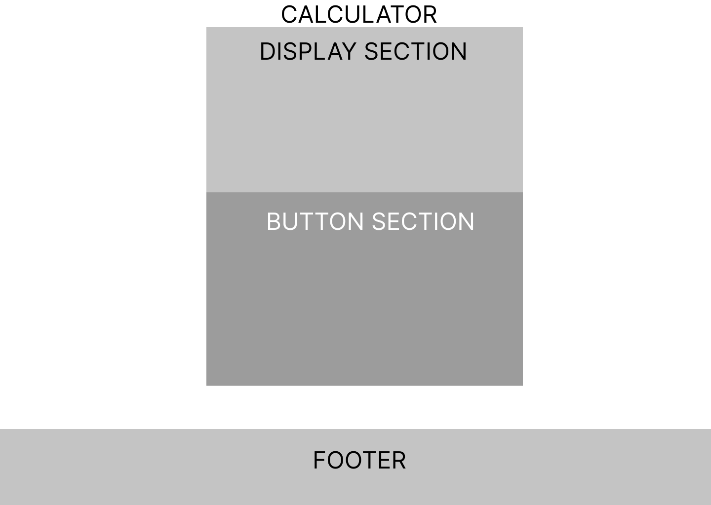
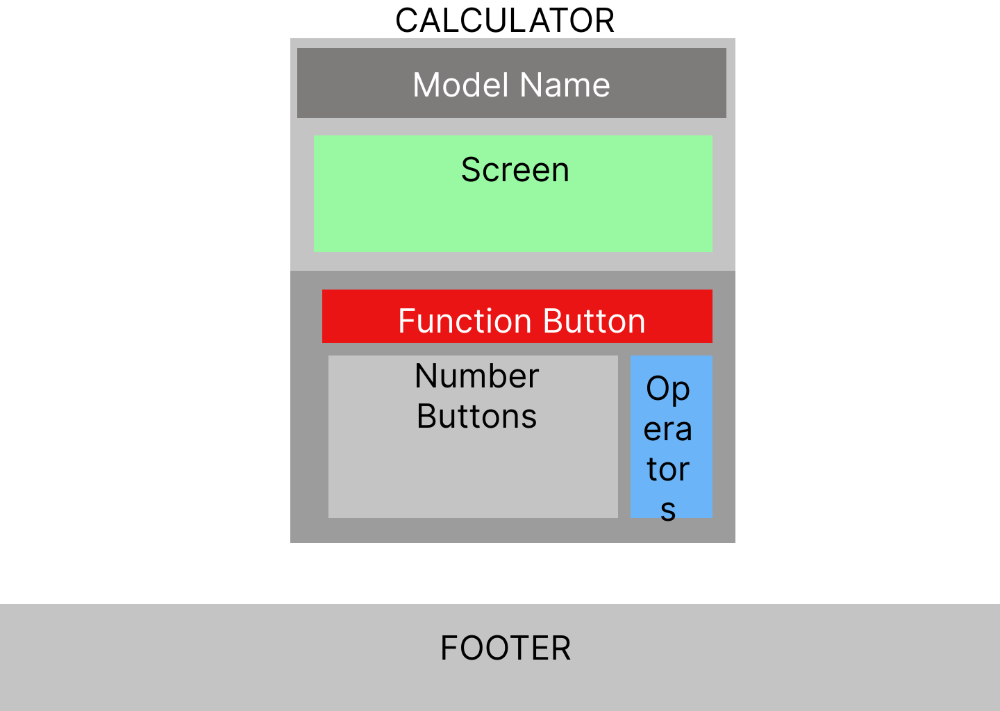
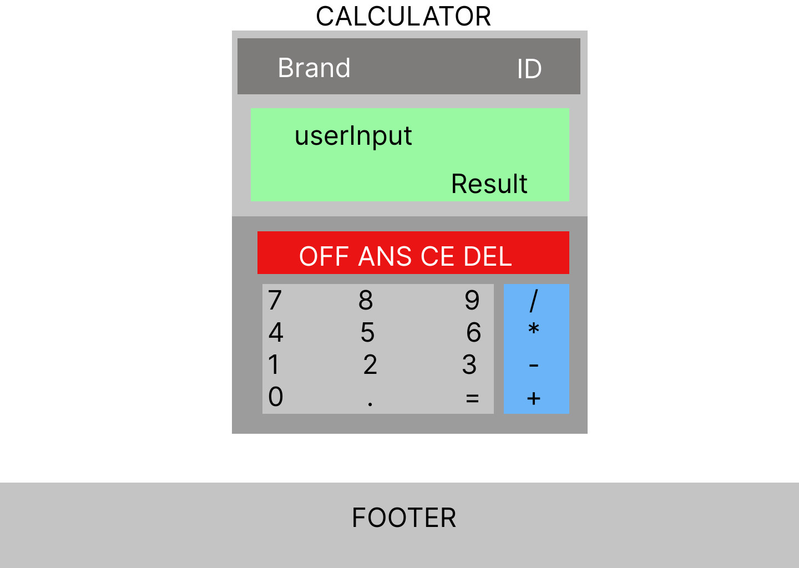
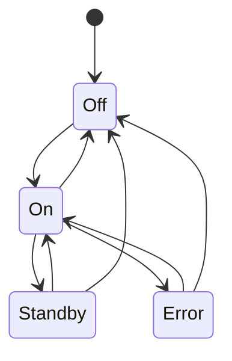
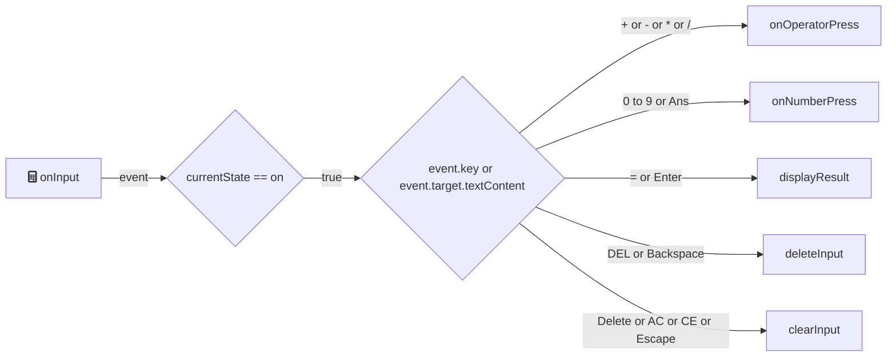
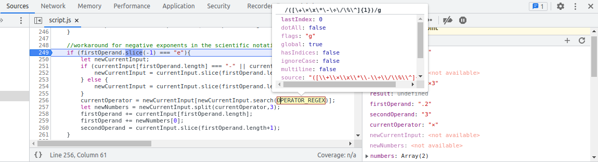
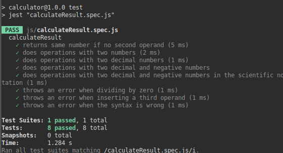

<h1 align="center">Part of<br>
<a href="https://www.theodinproject.com">
  
</a><br>
<a href="https://www.theodinproject.com">
  
</a>
<br>Course
</h1>

<p align="center">
  <a href="https://discord.com/invite/fbFCkYabZB">
    
  </a>
</p>

<p align="center">
  <a href="#-table-of-contents">Table of contents</a>
  •
  <a href="#-creation-process">Creation process</a>
  •
  <a href="#-debugging">Debugging</a>
  •
  <a href="#-what-ive-learned">What I've learned</a>
  •
  <a href="#-conclusion">Conclusion</a>
</p>

#  Project overview

This repository contains a calculator made with HTML, CSS and JavaScript.

This calculator can be used to perform addition, substraction, multiplication, division, exponentiation and get the remainder of a division. Numbers can be input via pressing keyboard keys or by interacting with the buttons.

Additionally, in the settings menu you can set the colors of the display screen's text and background, toggle dark mode theme and view/input past operations.

[▶️ Live demonstration](https://dorielrivalet.github.io/calculator)

<p style="text-align: center;">

<em>Supports scientific notation!</em>
</p>

# 🔤 Table of contents

- [ Project overview](#-project-overview)
- [🔤 Table of contents](#-table-of-contents)
  - [💡 Creation process](#-creation-process)
    - [❗ Prerequisites](#-prerequisites)
    - [💾 Setting up local and remote repositories](#-setting-up-local-and-remote-repositories)
    - [📜 Making the files](#-making-the-files)
    - [🍽️ Creating boilerplate code](#️-creating-boilerplate-code)
    - [❓ Understanding the problem](#-understanding-the-problem)
    - [🎨 Designing the page](#-designing-the-page)
    - [HTML](#html)
    - [CSS](#css)
    - [JavaScript](#javascript)
    - [🔢 Handling calculation and display function logic](#-handling-calculation-and-display-function-logic)
  - [🐛 Debugging](#-debugging)
  - [✅ Testing](#-testing)
    - [Jest](#jest)
    - [Live Server](#live-server)
  - [Pushing our local repository to our GitHub remote repository](#pushing-our-local-repository-to-our-github-remote-repository)
  - [📔 What I've learned](#-what-ive-learned)
  - [🏁 Conclusion](#-conclusion)

## 💡 Creation process

### ❗ Prerequisites

- [Linux Terminal](https://www.theodinproject.com/lessons/foundations-prerequisites#os-installation) (or Git Bash)
- [Visual Studio Code](https://www.theodinproject.com/lessons/foundations-text-editors#vscode-installation) (or other editors)
- [Git](https://www.theodinproject.com/lessons/foundations-setting-up-git#step-1-install-git)
- [GitHub account](https://www.theodinproject.com/lessons/foundations-setting-up-git#step-2-configure-git-and-github)
- Figma (or another tool for designing layouts)

### 💾 Setting up local and remote repositories

- First, let's start by making a repository on GitHub.
- Next, open the terminal with `Ctrl+Alt+T` and then clone the GitHub repository to a local folder with `git clone git@github.com:yourName/calculator.git`.

### 📜 Making the files

- Enter the calculator folder with `cd calculator` and type `touch index.html style.css script.js` to make our project's files.
- For organization purposes, we could also create folders and put certain files in there: type in `mkdir js style img` and then `mv script.js js/script.js` `mv style.css style/style.css` to move our files in those folders.

### 🍽️ Creating boilerplate code

Let's open *Visual Studio Code* and make it load all files of the present working directory. To do this, use the command `code .`

- Setting up the HTML file: Remember that you can also type `!` in an empty html file to automatically insert the boilerplate.

```html
<!DOCTYPE html>
<html lang="en">
<head>
  <meta charset="UTF-8">
  <meta http-equiv="X-UA-Compatible" content="IE=edge">
  <meta name="keywords" content="The Odin Project, Foundations, Calculator, GitHub, yourName, HTML, HTML5, CSS, CSS3, JavaScript">
  <meta name="copyright" content="© Doriel Rivalet">
  <meta name="viewport" content="width=device-width, initial-scale=1.0">
  <title>Let's do math! | THE ODIN PROJECT FOUNDATIONS</title>
  <link rel="stylesheet" href="./style/style.css">
  <script defer src="./js/script.js" type="text/javascript"></script>
  <link rel="shortcut icon" href="./img/calculator.ico">
</head>
<body>
  <header>
  </header>
  <main class="mainSection">
  </main>
  <footer class="footer">
  </footer>
</body>
</html>
```

### ❓ Understanding the problem

Now that we have our files and boilerplate code set up, we can review the project's tasks:

The main objective is **making a calculator**. What does making a calculator entail? It can entail the following:

1. Having a display screen
2. Also having buttons to input values into that screen.

Let's divide the first section into further subtasks:

- Display the user input.
- Additionally, show the result of the operation.

Then doing the same with the second section:

- Three categories of buttons: numbers, operators and function buttons.
- The function of each button changes depending on what category it is.

### 🎨 Designing the page

After listing the tasks that we would need to do, we can start by designing the look of the page.

<p style="text-align: center;">

<em>Main sections</em>
</p>

<p style="text-align: center;">

<em>Further subsections</em>
</p>

<p style="text-align: center;">

<em>Final result</em>
</p>

### HTML

```html
<body>
  <header>
  </header>
  <!-- calculator-->
  <main class="mainSection">
    <div class="calculatorSection">
      <div class="calculator">
        <div class="topSection">
          <div class="modelName">
            <button class="brandName">name</button>
            <button class="productId">id</button>
          </div>
          <div class="displaySection" id="display">
            <div class="inputSection">
              <div class="userInputValue"></div>
            </div>
            <div class="result">0</div>
          </div>
        </div>
        <div class="buttonSection">
          <button title="Turn ON/OFF" id="power" class="functionButton">ON</button>
          <button title="Input Previous Result Value" id="ans" class="functionButton">ANS</button>
          <button title="Clear Display [Escape|Delete]" id="ac" class="functionButton">AC</button>
          <button title="Undo [Backspace]" id="del" class="functionButton">DEL</button>

          <button id="seven" class="numberButton">7</button>
          <button id="eight" class="numberButton">8</button>
          <button id="nine" class="numberButton">9</button>
          <button title="Divide [/]" id="divide" class="operatorButton">÷</button>

          <button id="four" class="numberButton">4</button>
          <button id="five" class="numberButton">5</button>
          <button id="six" class="numberButton">6</button>
          <button title="Multiply [*|x]" id="multiply" class="operatorButton">×</button>

          <button id="one" class="numberButton">1</button>
          <button id="two" class="numberButton">2</button>
          <button id="three" class="numberButton">3</button>
          <button title="Substract [-]" id="minus" class="operatorButton">-</button>

          <button id="zero" class="numberButton">0</button>
          <button id="dot" class="numberButton">.</button>
          <button title="Calculate Result [Enter|=]" id="equal" class="equalButton">=</button>
          <button title="Add [+]" id="plus" class="operatorButton">+</button>
        </div>
      </div>
    </div>
  </main>
  <!-- footer-->
  <footer class="footer">
    <p>Copyright © <script>document.write(new Date().getFullYear())</script> <a href="https://github.com/yourName" target="_blank" id="creator" title="Check my GitHub profile!">yourName</a></p>
  </footer>
</body>
</html>
```

### CSS

**Flex-flow** structure:


<p style="text-align: center;">
<em>flex-flow is shorthand for flex direction and flex wrap.</em>
</p>


<p style="text-align: center;">
<em>Further designing the layout</em>
</p>


<p style="text-align: center;">
<em>End result</em>
</p>

**Flexbox** code:

```css
.calculatorSection{
  display:flex;
  flex-flow:column nowrap;
  flex:1 0;
  align-items: center;
  text-align: center;
}

.calculator{
  box-shadow: inset 0 0 0 4px hsl(0,0%,15%),
  0 0 0 4px hsl(240, 100%, 81%);
  margin-top: 64px;
  padding:20px;
  background-color: var(--calculator);
  border: 2px solid hsl(240, 100%, 75%);
  border-radius: 8px 8px 8px 8px;
  width: 400px;
  z-index: 1;
  position:relative;
  box-sizing: border-box;
}

.topSection{
  padding:8px;
  display:flex;
  flex-flow: column nowrap;
  width:auto;
  gap:4px;
}

.modelName{
  padding-top:16px;
  padding-bottom: 16px;
  display:flex;
  justify-content: space-between;
}

.displaySection{
  /*font default in case the other 2 doesn't load*/
  font-family: 'Press Start 2P', cursive;
  white-space: nowrap;
  overflow-x:auto;
  overflow-y: hidden;
  border: 4px solid hsl(0, 0%, 66%);
  box-shadow: inset 0 0 0 4px hsl(0, 0%, 56%),
  0 0 0 6px hsl(0, 0%, 76%);
  border-radius: 2px 2px 2px 2px;
  background-color: var(--screen-background);
  color:var(--screen-font);
  opacity: 0.6;
  padding-left:12px;
  padding-right:16px;
  padding-top:8px;
  padding-bottom: 0;
  box-sizing: content-box;
  display: flex;
  height:125px;
  flex-grow: 0;
  gap:0;
  flex-flow: column nowrap;
}
```

**Grid**: layout for the button sections, done with grid-template-areas.

```css
.buttonSection{
  display: grid;
  grid-template-columns: repeat(4, 1fr);
  grid-template-rows: repeat(5, 1fr);
  grid-column-gap: 8px;
  grid-row-gap: 8px;
  padding: 8px;
  grid-template-areas: "power ans a b"
                        "c d e f"
                        "g h i j"
                        "k l m n"
                        "o p q r";
}

#power {
  grid-area: power;
  border-radius: 100%;
  margin-bottom: 8px;
}

#ans {
  grid-area: ans;
  border-radius: 100%;
  margin-bottom: 8px;
}

#ac {
  grid-area: a;
  border-radius: 100%;
  margin-bottom: 8px;
}

#del {
  grid-area: b;
  border-radius: 100%;
  margin-bottom: 8px;
}

#seven {
  grid-area: c;
}

#eight {
  grid-area: d;
}

#nine {
  grid-area: e;
}

#divide {
  grid-area: f;
}

#four {
  grid-area: g;
}

#five {
  grid-area: h;
}

#six {
  grid-area: i;
}

#multiply {
  grid-area: j;
}

#one {
  grid-area: k;
}

#two {
  grid-area: l;
}

#three {
  grid-area: m;
}

#minus {
  grid-area: n;
}

#zero {
  grid-area: o;
}

#dot {
  grid-area: p;
}

#equal {
  grid-area: q;
}

#plus {
  grid-area: r;
}
```

### JavaScript

**Variables**: We start by declaring their names and if their values are either constant or going to change later on in the program,  and then assigning their values to either DOM nodes, other variables, strings, numbers, arrays or booleans.

- Anytime we assign something to a variable, we are doing three things:
  1. Creating the variable name in the current scope's lookup table (where all variable names are defined).
  2. Evaluating the expression to the right of the equals, and placing the result at some location in the browser's allocated memory.
  3. Assigning the variable name in that lookup table to reference that specific memory location.
- Ans stands for the previous calculator answer.
- Calculator states are used for handling the behaviour of functions after certain actions.

```javascript
const OPERATOR_REGEX= /([\+\×\x\*\-\÷\/\%\^]{1})/g; //for getting the operator later on
const INITIAL_INPUT_VALUE = "";
const INITIAL_RESULT_VALUE = 0;

const screen = document.getElementById("display");
const inputElement = document.querySelector('.userInputValue');
const resultElement = document.querySelector('.result');
const buttonsElements = document.querySelectorAll('.buttonSection button');
const numberButtonElements = document.querySelectorAll('.buttonSection .numberButton');
const operatorButtonElements = document.querySelectorAll('.buttonSection .operatorButton');
const functionButtonElements = document.querySelectorAll('.buttonSection .functionButton');
const clearButtonElement = document.querySelector('#ac');
const equalButtonElement = document.querySelector('.buttonSection .equalButton');
const powerButtonElement = document.querySelector('#power');
const plusButtonElement = document.querySelector('#plus');
const minusButtonElement = document.querySelector('#minus');
const multiplyButtonElement = document.querySelector('#multiply');
const divideButtonElement = document.querySelector('#divide');
const modelNameButtons = document.querySelectorAll('.modelName button');
const productIdElement = document.querySelector('.modelName .productId');
const calculatorElement = document.querySelector('.calculator');
const displaySectionElement = document.querySelector('.displaySection');
const githubIcon = document.querySelector(".fa-github");

let Ans; //stands for previous answer of the calculation
let currentState = "Off"; // 0/1/2/3 Off/On/Standby/Error.
```

**Functions**: also called *subroutines*, or *methods* when talking about objects.

- Various functions in this file apply the concept of early returns (also called guard clauses) to check whether the current calculator state or the value of the user input are correct.
- The common algorithm flow is as follows:
  1. Wait for calculator to be turned on.
  2. Process user input as either a keyboard key or a button press.
  3. Check if the input is either a number, an operator, or a function (such as Ans, Equals, Clear or Delete).
  4. Add the input to the display element (or delete it if pressing the Power, Clear or Delete buttons)
  5. When pressing the Equal button, evaluate the current input.
  6. If the current input passes the regex test, then perform the calculations according to the input.
  7. Display the result and store the result in the Ans variable if successful.
  8. Change the calculator state to either Error or Standby according to regex test or calculation test pass/fail.
  9. Go back to i., or ii. if pressing the Power Button at anytime.



<em>Diagram for calculator states</em>



<p style="text-align: center;">
<em>Algorithm flowchart for the onInput function</em>
</p>

```javascript
function add(x,y){
  return Number(x) + Number(y);
}

function substract(x,y){
  return Number(x) - Number(y);
}

function multiply(x,y){
  return Number(x) * Number(y);
}

function divide(x,y){
  if (Number(y) === 0){
    return false
  }
  return Number(x) / Number(y);
}

function switchPower(){
  if (currentState === "Off"){
    powerButtonElement.textContent = "OFF";
    currentState = "On";
    inputElement.style.opacity = 1;
    waitEffectElement.style.opacity = 1;
    resultElement.style.opacity = 1;
    inputElement.style.textAlign = "start";
  } else {
    powerButtonElement.textContent = "ON";
    currentState = "Off";
    clearInput()
    inputElement.style.opacity = 0;
    waitEffectElement.style.opacity = 0;
    resultElement.style.opacity = 0;
  }
}

function clearInput(){
  if (currentState === "Error" || currentState === "Standby"){
    currentState = "On";
    inputElement.style.textAlign = "start";
  }
  inputElement.textContent = INITIAL_INPUT_VALUE;
  resultElement.textContent = INITIAL_RESULT_VALUE;
  clearButtonElement.textContent = "AC";
}

function deleteInput(){
  if (currentState === "Error" || currentState === "Standby"){
    return;
  }
  if (inputElement.textContent.length === 1){
    inputElement.textContent = "";
    clearButtonElement.textContent = "AC";
    return;
  }  
  inputElement.textContent = inputElement.textContent.slice(0,inputElement.textContent.length-1);
}

function operate(operator, operand1, operand2){
  let currentResult;
  switch(operator){
    case "+":
      currentResult = add(operand1,operand2);
      break;
    case "-":
      currentResult = substract(operand1,operand2);
      break;
    case "*":
    case "×":
    case "x":
      currentResult = multiply(operand1,operand2);
      break;
    case "/":
    case "÷":
      currentResult = divide(operand1,operand2);
      break;
    case "^":
      currentResult = power(operand1,operand2);
      break;
    case "%":
      currentResult = modulo(operand1,operand2);
  }
  return currentResult
}

function onNumberPress(input){
  if (currentState === "Error" || input === undefined){
    return
  }
  if (inputElement.textContent === "") {
    inputElement.textContent += input;
    clearButtonElement.textContent = "CE";
    return
  }
  if (currentState === "Standby"){
    currentState = "On";
    inputElement.textContent = "";
    inputElement.textContent += input;
    return
  }
  inputElement.textContent += input;
}

function onOperatorPress(input){
  if (currentState === "Error"){
    return
  }
  if (inputElement.textContent === ""){
    inputElement.textContent = "0"+input;
    clearButtonElement.textContent = "CE";
    return
  }
  if (currentState === "Standby"){
    currentState = "On";
    inputElement.textContent = "";
    inputElement.textContent += Ans+input;
    return
  }
  inputElement.textContent += input;
}

function onInput(event) {
  if (currentState === "Off"){
    return
  }
  let input = event.key || event.target.textContent; 
  switch (input){
    case "0":
    case "1":
    case "2":
    case "3":
    case "4":
    case "5":
    case "6":
    case "7":
    case "8":
    case "9":
    case ".": //techniqually not a number. used for making decimals.
      onNumberPress(input);
      break;
    case "+":
    case "-":
    case "*":
    case "x":
    case "/":
    case "÷":
    case "×":
    case "%": //modulo
    case "^": //exponent
      onOperatorPress(input);
      break;
    case "DEL":
    case "Backspace":
      deleteInput();
      break;
    case "Delete":
    case "AC":
    case "CE":
    case "Escape":
      clearInput();
      break;
    case "Enter":
    case "=":
      displayResult(calculateResult());//calculateResult returns the result value which displayResult then displays.
      break;
    case "ANS": //previous stored answer, or undefined if not stored.
    case "A":
      onNumberPress(Ans);
  }
}
```

**Event listeners**: We attach events to functions. When those events fire, it calls a certain function.

- Adding event listeners to the DOM Nodes and Nodelists; which are referenced through variable names, whose values where gotten via the query selector subroutine.
- Since buttonsElements is a nodelist, we can use the forEach method to add an event listener to each button element.

```javascript
document.addEventListener("keydown", onInput);
buttonsElements.forEach(function(currentButton){
  currentButton.addEventListener("click", onInput)
});
powerButtonElement.addEventListener("click", switchPower);
```

### 🔢 Handling calculation and display function logic

*See also [Jest](#Jest)*

There's many ways to handle this, here's how it could be done with regex:

```javascript
function calculateResult(){
  if (currentState === "Error" || currentState === "Standby" || inputElement.textContent === ""){
    return false
  }

  let result;
  let currentInput = inputElement.textContent;
  //https://stackoverflow.com/questions/638565/parsing-scientific-notation-sensibly
  //written with help of https://regexr.com/ cheatsheet
  let inputRegex = /^[+\-]?(?=\.\d|\d)(?:0|[1-9]\d*)?(?:\.\d+)?(?:(?<=\d)(?:[eE][+\-]?\d+))?([\+\×\x\*\-\÷\/\%\^]{1})[+\-]?(?=\.\d|\d)(?:0|[1-9]\d*)?(?:\.\d+)?(?:(?<=\d)(?:[eE][+\-]?\d+))?$/g;
  // first operand: /^[+\-]?(?=\.\d|\d)(?:0|[1-9]\d*)?(?:\.\d+)?(?:(?<=\d)(?:[eE][+\-]?\d+))?
  // operator: ([\+\×\x\*\-\÷\/\%\^]{1})
  // second operand: [+\-]?(?=\.\d|\d)(?:0|[1-9]\d*)?(?:\.\d+)?(?:(?<=\d)(?:[eE][+\-]?\d+))?$/g;

  let onlyFirstOperandRegex = /^[+\-]?(?=\.\d|\d)(?:0|[1-9]\d*)?(?:\.\d+)?(?:(?<=\d)(?:[eE][+\-]?\d+))?$/g;
  let onlyInputFirstOperand = onlyFirstOperandRegex.test(currentInput);
  let isSyntaxCorrect = inputRegex.test(currentInput);

  if(onlyInputFirstOperand){
    result = Number.parseFloat(currentInput);
    if (result){
      return result;
    } else {
      return "Syntax ERROR";
    }
  }
  
  if (!isSyntaxCorrect){ 
    return "Syntax ERROR";
  }

  //lazy initialization
  let currentOperator;
  let numbers;
  let firstOperand;
  let secondOperand;

  //solution for negative numbers
  if (currentInput[0] === "-"){ 
    let newCurrentInput = currentInput.slice(1);
    currentOperator = newCurrentInput[newCurrentInput.search(OPERATOR_REGEX)];
    numbers = newCurrentInput.split(currentOperator,3);
    firstOperand = "-"+numbers[0];
    secondOperand = currentInput.slice(firstOperand.length+1);
  } else {
    currentOperator = currentInput[currentInput.search(OPERATOR_REGEX)];
    numbers = currentInput.split(currentOperator,3);
    firstOperand = numbers[0];
    secondOperand = currentInput.slice(firstOperand.length+1);
  }
  
  //solution for negative exponents in the scientific notation
  if (firstOperand.slice(-1) === "e"){
    let newCurrentInput;
    if (currentInput[firstOperand.length] === "-" || currentInput[firstOperand.length] === "+"){
      newCurrentInput = currentInput.slice(firstOperand.length+1);
    } else {
      newCurrentInput = currentInput.slice(firstOperand.length);
    }
    currentOperator = newCurrentInput[newCurrentInput.search(OPERATOR_REGEX)];
    let newNumbers = newCurrentInput.split(currentOperator,3);
    firstOperand += currentInput[firstOperand.length];
    firstOperand += newNumbers[0];
    secondOperand = currentInput.slice(firstOperand.length+1);
  }

  if (secondOperand === "-undefined"){ //because of secondOperand = "-"+numbers[2]; and numbers[2] being undefined and doing + concatenation between string and undefined returns -undefined as a string.
    return "Syntax ERROR";
  }
 
  result = operate(currentOperator,firstOperand,secondOperand);

  if (result === false || Number.isNaN(result)){
    return "Math ERROR";
  }

  return result
}

function displayResult(result){
  if (result === false){
    return
  }
  switch(result){
    case "Syntax ERROR":
    case "Math ERROR":
      inputElement.textContent = result;
      resultElement.textContent = "";
      currentState = "Error";
      inputElement.style.textAlign = "end";
      break;
    default:
      //https://stackoverflow.com/questions/11832914/how-to-round-to-at-most-2-decimal-places-if-necessary
      result = Math.round((result + Number.EPSILON) * 10000) / 10000;
      resultElement.textContent = result;
      currentState = "Standby";
      Ans = result;
  }
}
```

***Caveats: this calculator only does operations with 2 numbers at a time. For adding more operands while still following order of operations (PEMDAS), we would need to do [something like this](https://www.reddit.com/r/learnpython/comments/l1ybvx/comment/gk4b8lq/?utm_source=share&utm_medium=web2x&context=3), which is beyond the scope of the project's objectives.***

## 🐛 Debugging

For debugging my code, I used the following:

- JavaScript console object
  - `console.log`, `console.table`
- Google Chrome's DevTools (*Inspect Element*) `Ctrl+Shift+I`
  - Inspector
  - Elements
  - Console
    - Stack trace, errors
  - Sources
    - Breakpoints, Watch
- Rethinking approachs
  - Refactoring, Simplifying, Modularising, Process of elimination



## ✅ Testing

### Jest



First we create the specifications (*specs*) of the function. What type of *inputs* do we need? What kind of *outputs* do we expect? Program accordingly to these questions.
Building a prototype of the function we want to make and test it in isolation from the rest of the source code can help when trying to debug or pinpoint a potential issue.

### Live Server

For testing the webpage in a browser, we can use Visual Studio Code's extension *Live Server* (press `Alt+L` then `Alt+O`)

## Pushing our local repository to our GitHub remote repository

Before we do that, it's recommended to check the state of the remote repository with `git fetch` and our local repository with `git status`. *If* working with multiple branches, *then* also use `git branch`.

- Adding the changes: `git add fileName.extensionName` or `git add .` or `git add /folderName/fileName.extensionName`
- Commiting the changes: `git commit -m "commitComment"` or `git commit`
- Pushing the changes: `git push origin branchName` or `git push origin main` or `git push`

## 📔 What I've learned

[List of concepts I've learned during this course (plus own research)](https://github.com/DorielRivalet/patchouli-computatrum)

## 🏁 Conclusion

Overall, it was a very fun project to finish. There could be some improvements, such as replacing the regex logic with an object-oriented programming approach (*i.e.*, instead of getting the operands and operator with a regular expression, make a Calculator object and store the values there when pressing the equal button).
