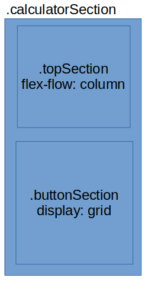
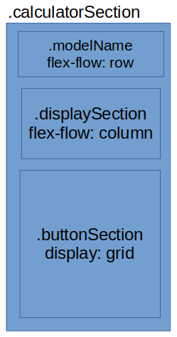

<h1 align="center">Part of<br>
<a href="https://theodinproject.com">
  
</a><br>
<a href="https://github.com/anuraghazra/convoychat">
  
</a>
<br>Course
</h1>

<p align="center">
  <a href="https://discord.com/invite/fbFCkYabZB">
    
  </a>
</p>

<p align="center">
  <a href="#table-of-contents">Table of contents</a>
  •
  <a href="#creation-process">Creation process</a>
  •
  <a href="#debugging">Debugging</a>
  •
  <a href="#what-ive-learned">What I've learned</a>
  •
  <a href="#conclusion">Conclusion</a>
</p>

#  Project overview

This repository contains a calculator made with HTML, CSS and JavaScript.

This calculator can be used to perform addition, substraction, multiplication, division, exponentiation and get the remainder of a division. Numbers can be input via pressing keyboard keys or by interacting with the buttons.

Additionally, in the settings menu you can set the colors of the display screen's text and background, toggle dark mode theme and view/input past operations.

[▶️ Live demonstration](https://dorielrivalet.github.io/calculator)


<p style="text-align: center;">
Supports scientific notation!
</p>

# 🔤 Table of contents

- [ Project overview](#-project-overview)
- [🔤 Table of contents](#-table-of-contents)
  - [💡 Creation process](#-creation-process)
    - [❗ Prerequisites](#-prerequisites)
    - [💾 Setting up local and remote repositories](#-setting-up-local-and-remote-repositories)
    - [📜 Making the files](#-making-the-files)
    - [🍽️ Creating boilerplate code](#️-creating-boilerplate-code)
    - [❓ Understanding the problem](#-understanding-the-problem)
    - [🎨 Designing the page](#-designing-the-page)
    - [HTML](#html)
    - [CSS](#css)
    - [JavaScript](#javascript)
    - [🔢 Handling calculation and display function logic](#-handling-calculation-and-display-function-logic)
  - [🐛 Debugging](#-debugging)
  - [✅ Unit Testing](#-unit-testing)
  - [Pushing our local repository to our GitHub remote repository](#pushing-our-local-repository-to-our-github-remote-repository)
  - [📔 What I've learned](#-what-ive-learned)
  - [🏁 Conclusion](#-conclusion)

## 💡 Creation process

### ❗ Prerequisites

- [Linux Terminal](https://www.theodinproject.com/lessons/foundations-prerequisites#os-installation) (or Git Bash)
- [Visual Studio Code](https://www.theodinproject.com/lessons/foundations-text-editors#vscode-installation) (or other editors)
- [Git](https://www.theodinproject.com/lessons/foundations-setting-up-git#step-1-install-git)
- [GitHub account](https://www.theodinproject.com/lessons/foundations-setting-up-git#step-2-configure-git-and-github)
- Figma (or another tool for designing layouts)

### 💾 Setting up local and remote repositories

- First, let's start by making a repository on GitHub.
- Next, open the terminal with `Ctrl+Alt+T` and then clone the GitHub repository to a local folder with `git clone git@github.com:yourName/calculator.git`.

### 📜 Making the files

- Enter the calculator folder with `cd calculator` and type `touch index.html style.css script.js` to make our project's files.
- For organization purposes, we could also create folders and put certain files in there: type in `mkdir js style img` and then `mv script.js js/script.js` `mv style.css style/style.css` to move our files in those folders.

### 🍽️ Creating boilerplate code

Let's open *Visual Studio Code* and make it load all files of the present working directory. To do this, use the command `code .`

- Setting up the HTML file: Remember that you can also type `!` in an empty html file to automatically insert the boilerplate.

```html
<!DOCTYPE html>
<html lang="en">
<head>
  <meta charset="UTF-8">
  <meta http-equiv="X-UA-Compatible" content="IE=edge">
  <meta name="keywords" content="The Odin Project, Foundations, Calculator, GitHub, yourName, HTML, HTML5, CSS, CSS3, JavaScript">
  <meta name="copyright" content="© Doriel Rivalet">
  <meta name="viewport" content="width=device-width, initial-scale=1.0">
  <title>Let's do math! | THE ODIN PROJECT FOUNDATIONS</title>
  <link rel="stylesheet" href="./style/style.css">
  <script defer src="./js/script.js" type="text/javascript"></script>
  <link rel="shortcut icon" href="./img/calculator.ico">
</head>
<body>
  <header>
  </header>
  <main class="mainSection">
  </main>
  <footer class="footer">
  </footer>
</body>
</html>
```

### ❓ Understanding the problem

Now that we have our files and boilerplate code set up, we can review the project's tasks:

The main objective is **making a calculator**. What does making a calculator entail? It can entail the following:

1. Having a display screen
2. Also having buttons to input values into that screen.

Let's divide the first section into further subtasks:

- Display the user input.
- Additionally, show the result of the operation.

Then doing the same with the second section:

- Three categories of buttons: numbers, operators and function buttons.
- The function of each button changes depending on what category it is.

### 🎨 Designing the page

After listing the tasks that we would need to do, we can start by designing the look of the page.


<p style="text-align: center;">
Main sections
</p>


<p style="text-align: center;">
Further subsections
</p>


<p style="text-align: center;">
Final result
</p>

### HTML

```html
<body>
  <header>
  </header>
  <!-- calculator-->
  <main class="mainSection">
    <div class="calculatorSection">
      <div class="calculator">
        <div class="topSection">
          <div class="modelName">
            <button class="brandName">name</button>
            <button class="productId">id</button>
          </div>
          <div class="displaySection" id="display">
            <div class="inputSection">
              <div class="userInputValue"></div>
            </div>
            <div class="result">0</div>
          </div>
        </div>
        <div class="buttonSection">
          <button title="Turn ON/OFF" id="power" class="functionButton">ON</button>
          <button title="Input Previous Result Value" id="ans" class="functionButton">ANS</button>
          <button title="Clear Display [Escape|Delete]" id="ac" class="functionButton">AC</button>
          <button title="Undo [Backspace]" id="del" class="functionButton">DEL</button>

          <button id="seven" class="numberButton">7</button>
          <button id="eight" class="numberButton">8</button>
          <button id="nine" class="numberButton">9</button>
          <button title="Divide [/]" id="divide" class="operatorButton">÷</button>

          <button id="four" class="numberButton">4</button>
          <button id="five" class="numberButton">5</button>
          <button id="six" class="numberButton">6</button>
          <button title="Multiply [*|x]" id="multiply" class="operatorButton">×</button>

          <button id="one" class="numberButton">1</button>
          <button id="two" class="numberButton">2</button>
          <button id="three" class="numberButton">3</button>
          <button title="Substract [-]" id="minus" class="operatorButton">-</button>

          <button id="zero" class="numberButton">0</button>
          <button id="dot" class="numberButton">.</button>
          <button title="Calculate Result [Enter|=]" id="equal" class="equalButton">=</button>
          <button title="Add [+]" id="plus" class="operatorButton">+</button>
        </div>
      </div>
    </div>
  </main>
  <!-- footer-->
  <footer class="footer">
    <p>Copyright © <script>document.write(new Date().getFullYear())</script> <a href="https://github.com/yourName" target="_blank" id="creator" title="Check my GitHub profile!">yourName</a></p>
  </footer>
</body>
</html>
```

### CSS

**Flex-flow** structure:


<p style="text-align: center;">
flex-flow is shorthand for flex direction and flex wrap.
</p>


<p style="text-align: center;">
Further designing the layout
</p>


<p style="text-align: center;">
End result
</p>

**Flexbox** code:

```css
.calculatorSection{
  display:flex;
  flex-flow:column nowrap;
  flex:1 0;
  align-items: center;
  text-align: center;
}

.calculator{
  box-shadow: inset 0 0 0 4px hsl(0,0%,15%),
  0 0 0 4px hsl(240, 100%, 81%);
  margin-top: 64px;
  padding:20px;
  background-color: var(--calculator);
  border: 2px solid hsl(240, 100%, 75%);
  border-radius: 8px 8px 8px 8px;
  width: 400px;
  z-index: 1;
  position:relative;
  box-sizing: border-box;
}

.topSection{
  padding:8px;
  display:flex;
  flex-flow: column nowrap;
  width:auto;
  gap:4px;
}

.modelName{
  padding-top:16px;
  padding-bottom: 16px;
  display:flex;
  justify-content: space-between;
}

.displaySection{
  /*font default in case the other 2 doesn't load*/
  font-family: 'Press Start 2P', cursive;
  white-space: nowrap;
  overflow-x:auto;
  overflow-y: hidden;
  border: 4px solid hsl(0, 0%, 66%);
  box-shadow: inset 0 0 0 4px hsl(0, 0%, 56%),
  0 0 0 6px hsl(0, 0%, 76%);
  border-radius: 2px 2px 2px 2px;
  background-color: var(--screen-background);
  color:var(--screen-font);
  opacity: 0.6;
  padding-left:12px;
  padding-right:16px;
  padding-top:8px;
  padding-bottom: 0;
  box-sizing: content-box;
  display: flex;
  height:125px;
  flex-grow: 0;
  gap:0;
  flex-flow: column nowrap;
}
```

**Grid**: layout for the button sections, done with grid-template-areas.

```css
.buttonSection{
  display: grid;
  grid-template-columns: repeat(4, 1fr);
  grid-template-rows: repeat(5, 1fr);
  grid-column-gap: 8px;
  grid-row-gap: 8px;
  padding: 8px;
  grid-template-areas: "power ans a b"
                        "c d e f"
                        "g h i j"
                        "k l m n"
                        "o p q r";
}

#power {
  grid-area: power;
  border-radius: 100%;
  margin-bottom: 8px;
}

#ans {
  grid-area: ans;
  border-radius: 100%;
  margin-bottom: 8px;
}

#ac {
  grid-area: a;
  border-radius: 100%;
  margin-bottom: 8px;
}

#del {
  grid-area: b;
  border-radius: 100%;
  margin-bottom: 8px;
}

#seven {
  grid-area: c;
}

#eight {
  grid-area: d;
}

#nine {
  grid-area: e;
}

#divide {
  grid-area: f;
}

#four {
  grid-area: g;
}

#five {
  grid-area: h;
}

#six {
  grid-area: i;
}

#multiply {
  grid-area: j;
}

#one {
  grid-area: k;
}

#two {
  grid-area: l;
}

#three {
  grid-area: m;
}

#minus {
  grid-area: n;
}

#zero {
  grid-area: o;
}

#dot {
  grid-area: p;
}

#equal {
  grid-area: q;
}

#plus {
  grid-area: r;
}
```

### JavaScript

**Variables**: We start by declaring their names and if their values are either constant or going to change later on in the program,  and then assigning their values to either DOM nodes, other variables, strings, numbers, arrays or booleans.

- Anytime we assign something to a variable, we are doing three things:
  1. Creating the variable name in the current scope's lookup table (where all variable names are defined).
  2. Evaluating the expression to the right of the equals, and placing the result at some location in the browser's allocated memory.
  3. Assigning the variable name in that lookup table to reference that specific memory location.
- Ans stands for the previous calculator answer.
- Calculator states are used for handling the behaviour of functions after certain actions.

```javascript
const OPERATOR_REGEX= /([\+\×\x\*\-\÷\/\%\^]{1})/g; //for getting the operator later on
const INITIAL_INPUT_VALUE = "";
const INITIAL_RESULT_VALUE = 0;

const screen = document.getElementById("display");
const inputElement = document.querySelector('.userInputValue');
const resultElement = document.querySelector('.result');
const buttonsElements = document.querySelectorAll('.buttonSection button');
const numberButtonElements = document.querySelectorAll('.buttonSection .numberButton');
const operatorButtonElements = document.querySelectorAll('.buttonSection .operatorButton');
const functionButtonElements = document.querySelectorAll('.buttonSection .functionButton');
const clearButtonElement = document.querySelector('#ac');
const equalButtonElement = document.querySelector('.buttonSection .equalButton');
const powerButtonElement = document.querySelector('#power');
const plusButtonElement = document.querySelector('#plus');
const minusButtonElement = document.querySelector('#minus');
const multiplyButtonElement = document.querySelector('#multiply');
const divideButtonElement = document.querySelector('#divide');
const modelNameButtons = document.querySelectorAll('.modelName button');
const productIdElement = document.querySelector('.modelName .productId');
const calculatorElement = document.querySelector('.calculator');
const displaySectionElement = document.querySelector('.displaySection');
const githubIcon = document.querySelector(".fa-github");

let Ans; //stands for previous answer of the calculation
let currentState = "Off"; // 0/1/2/3 Off/On/Standby/Error.
```

**Functions**: also called *subroutines*, or *methods* when talking about objects.

- Various functions in this file apply the concept of early returns (also called guard clauses) to check whether the current calculator state or the value of the user input are correct.
- The common algorithm flow is as follows:
  1. Wait for calculator to be turned on.
  2. Process user input as either a keyboard key or a button press.
  3. Check if the input is either a number, an operator, or a function (such as Ans, Equals, Clear or Delete).
  4. Add the input to the display element (or delete it if pressing the Power, Clear or Delete buttons)
  5. When pressing the Equal button, evaluate the current input.
  6. If the current input passes the regex test, then perform the calculations according to the input.
  7. Display the result and store the result in the Ans variable if successful.
  8. Change the calculator state to either Error or Standby according to regex test or calculation test pass/fail.
  9. Go back to i., or ii. if pressing the Power Button at anytime.


Diagram for calculator states


<p style="text-align: center;">
Algorithm flowchart for the onInput function
</p>

```javascript
function add(x,y){
  return Number(x) + Number(y);
}

function substract(x,y){
  return Number(x) - Number(y);
}

function multiply(x,y){
  return Number(x) * Number(y);
}

function divide(x,y){
  if (Number(y) === 0){
    return false
  }
  return Number(x) / Number(y);
}

function switchPower(){
  if (currentState === "Off"){
    powerButtonElement.textContent = "OFF";
    currentState = "On";
    inputElement.style.opacity = 1;
    waitEffectElement.style.opacity = 1;
    resultElement.style.opacity = 1;
    inputElement.style.textAlign = "start";
  } else {
    powerButtonElement.textContent = "ON";
    currentState = "Off";
    clearInput()
    inputElement.style.opacity = 0;
    waitEffectElement.style.opacity = 0;
    resultElement.style.opacity = 0;
  }
}

function clearInput(){
  if (currentState === "Error" || currentState === "Standby"){
    currentState = "On";
    inputElement.style.textAlign = "start";
  }
  inputElement.textContent = INITIAL_INPUT_VALUE;
  resultElement.textContent = INITIAL_RESULT_VALUE;
  clearButtonElement.textContent = "AC";
}

function deleteInput(){
  if (currentState === "Error" || currentState === "Standby"){
    return;
  }
  if (inputElement.textContent.length === 1){
    inputElement.textContent = "";
    clearButtonElement.textContent = "AC";
    return;
  }  
  inputElement.textContent = inputElement.textContent.slice(0,inputElement.textContent.length-1);
}

function operate(operator, operand1, operand2){
  let currentResult;
  switch(operator){
    case "+":
      currentResult = add(operand1,operand2);
      break;
    case "-":
      currentResult = substract(operand1,operand2);
      break;
    case "*":
    case "×":
    case "x":
      currentResult = multiply(operand1,operand2);
      break;
    case "/":
    case "÷":
      currentResult = divide(operand1,operand2);
      break;
    case "^":
      currentResult = power(operand1,operand2);
      break;
    case "%":
      currentResult = modulo(operand1,operand2);
  }
  return currentResult
}

function onNumberPress(input){
  if (currentState === "Error" || input === undefined){
    return
  }
  if (inputElement.textContent === "") {
    inputElement.textContent += input;
    clearButtonElement.textContent = "CE";
    return
  }
  if (currentState === "Standby"){
    currentState = "On";
    inputElement.textContent = "";
    inputElement.textContent += input;
    return
  }
  inputElement.textContent += input;
}

function onOperatorPress(input){
  if (currentState === "Error"){
    return
  }
  if (inputElement.textContent === ""){
    inputElement.textContent = "0"+input;
    clearButtonElement.textContent = "CE";
    return
  }
  if (currentState === "Standby"){
    currentState = "On";
    inputElement.textContent = "";
    inputElement.textContent += Ans+input;
    return
  }
  inputElement.textContent += input;
}

function onInput(event) {
  if (currentState === "Off"){
    return
  }
  let input = event.key || event.target.textContent; 
  switch (input){
    case "0":
    case "1":
    case "2":
    case "3":
    case "4":
    case "5":
    case "6":
    case "7":
    case "8":
    case "9":
    case ".": //techniqually not a number. used for making decimals.
      onNumberPress(input);
      break;
    case "+":
    case "-":
    case "*":
    case "x":
    case "/":
    case "÷":
    case "×":
    case "%": //modulo
    case "^": //exponent
      onOperatorPress(input);
      break;
    case "DEL":
    case "Backspace":
      deleteInput();
      break;
    case "Delete":
    case "AC":
    case "CE":
    case "Escape":
      clearInput();
      break;
    case "Enter":
    case "=":
      displayResult(calculateResult());//calculateResult returns the result value which displayResult then displays.
      break;
    case "ANS": //previous stored answer, or undefined if not stored.
    case "A":
      onNumberPress(Ans);
  }
}
```

**Event listeners**: We attach events to functions. When those events fire, it calls a certain function.

- Adding event listeners to the DOM Nodes and Nodelists; which are referenced through variable names, whose values where gotten via the query selector subroutine.
- Since buttonsElements is a nodelist, we can use the forEach method to add an event listener to each button element.

```javascript
document.addEventListener("keydown", onInput);
buttonsElements.forEach(function(currentButton){
  currentButton.addEventListener("click", onInput)
});
powerButtonElement.addEventListener("click", switchPower);
```

### 🔢 Handling calculation and display function logic

There's many ways to handle this, here's how it could be done with regex:

```javascript
function calculateResult(){
  if (currentState === "Error" || currentState === "Standby" || inputElement.textContent === ""){
    return false
  }

  let result;
  let currentInput = inputElement.textContent;
  //https://stackoverflow.com/questions/638565/parsing-scientific-notation-sensibly
  //written with help of https://regexr.com/ cheatsheet
  let inputRegex = /^[+\-]?(?=\.\d|\d)(?:0|[1-9]\d*)?(?:\.\d+)?(?:(?<=\d)(?:[eE][+\-]?\d+))?([\+\×\x\*\-\÷\/\%\^]{1})[+\-]?(?=\.\d|\d)(?:0|[1-9]\d*)?(?:\.\d+)?(?:(?<=\d)(?:[eE][+\-]?\d+))?$/g;
  // first operand: /^[+\-]?(?=\.\d|\d)(?:0|[1-9]\d*)?(?:\.\d+)?(?:(?<=\d)(?:[eE][+\-]?\d+))?
  // operator: ([\+\×\x\*\-\÷\/\%\^]{1})
  // second operand: [+\-]?(?=\.\d|\d)(?:0|[1-9]\d*)?(?:\.\d+)?(?:(?<=\d)(?:[eE][+\-]?\d+))?$/g;

  let onlyFirstOperandRegex = /^[+\-]?(?=\.\d|\d)(?:0|[1-9]\d*)?(?:\.\d+)?(?:(?<=\d)(?:[eE][+\-]?\d+))?$/g;
  let onlyInputFirstOperand = onlyFirstOperandRegex.test(currentInput);
  let isSyntaxCorrect = inputRegex.test(currentInput);

  if(onlyInputFirstOperand){
    result = Number.parseFloat(currentInput);
    if (result){
      return result;
    } else {
      return "Syntax ERROR";
    }
  }
  
  if (!isSyntaxCorrect){ 
    return "Syntax ERROR";
  }

  //lazy initialization
  let currentOperator;
  let numbers;
  let firstOperand;
  let secondOperand;

  //solution for negative numbers
  if (currentInput[0] === "-"){ 
    let newCurrentInput = currentInput.slice(1);
    currentOperator = newCurrentInput[newCurrentInput.search(OPERATOR_REGEX)];
    numbers = newCurrentInput.split(currentOperator,3);
    firstOperand = "-"+numbers[0];
    secondOperand = currentInput.slice(firstOperand.length+1);
  } else {
    currentOperator = currentInput[currentInput.search(OPERATOR_REGEX)];
    numbers = currentInput.split(currentOperator,3);
    firstOperand = numbers[0];
    secondOperand = currentInput.slice(firstOperand.length+1);
  }
  
  //solution for negative exponents in the scientific notation
  if (firstOperand.slice(-1) === "e"){
    let newCurrentInput;
    if (currentInput[firstOperand.length] === "-" || currentInput[firstOperand.length] === "+"){
      newCurrentInput = currentInput.slice(firstOperand.length+1);
    } else {
      newCurrentInput = currentInput.slice(firstOperand.length);
    }
    currentOperator = newCurrentInput[newCurrentInput.search(OPERATOR_REGEX)];
    let newNumbers = newCurrentInput.split(currentOperator,3);
    firstOperand += currentInput[firstOperand.length];
    firstOperand += newNumbers[0];
    secondOperand = currentInput.slice(firstOperand.length+1);
  }

  if (secondOperand === "-undefined"){ //because of secondOperand = "-"+numbers[2]; and numbers[2] being undefined and doing + concatenation between string and undefined returns -undefined as a string.
    return "Syntax ERROR";
  }
 
  result = operate(currentOperator,firstOperand,secondOperand);

  if (result === false || Number.isNaN(result)){
    return "Math ERROR";
  }

  return result
}

function displayResult(result){
  if (result === false){
    return
  }
  switch(result){
    case "Syntax ERROR":
    case "Math ERROR":
      inputElement.textContent = result;
      resultElement.textContent = "";
      currentState = "Error";
      inputElement.style.textAlign = "end";
      break;
    default:
      //https://stackoverflow.com/questions/11832914/how-to-round-to-at-most-2-decimal-places-if-necessary
      result = Math.round((result + Number.EPSILON) * 10000) / 10000;
      resultElement.textContent = result;
      currentState = "Standby";
      Ans = result;
  }
}
```

***Caveats: this calculator only does operations with 2 numbers at a time. For adding more operands while still following order of operations (PEMDAS), we would need to do [something like this](https://www.reddit.com/r/learnpython/comments/l1ybvx/comment/gk4b8lq/?utm_source=share&utm_medium=web2x&context=3), which is beyond the scope of the project's objectives.***

## 🐛 Debugging

For debugging my code, I used the following:

- JavaScript console object
  - `console.log`, `console.table`
- Google Chrome's DevTools (*Inspect Element*)
  - Inspector
  - Elements
  - Console
    - Stack trace, errors
  - Sources
    - Breakpoints, Watch
- Rethinking approachs
  - Refactoring, Simplifying, Modularising, Process of elimination

## ✅ Unit Testing

## Pushing our local repository to our GitHub remote repository

Before we do that, it's recommended to check the state of the remote repository with `git fetch` and our local repository with `git status`. *If* working with multiple branches, *then* also use `git branch`.

- Adding the changes: `git add fileName.extensionName` or `git add .` or `git add /folderName/fileName.extensionName`
- Commiting the changes: `git commit -m "commitComment"` or `git commit`
- Pushing the changes: `git push origin branchName` or `git push origin main` or `git push`

## 📔 What I've learned

List of concepts I've learned throurough this course (plus own research)

- [Internet Infrastructure](https://www.theodinproject.com/lessons/foundations-how-does-the-web-work)
  - Client and server, packets.
  - Web page -> Website -> Web Server
  - IP Adress -> Router -> ISP
  - DNS
  - TCP and UDP
- Virtual Machines
- Programming in general
  - [**Problem Solving (most important concept)**](https://www.theodinproject.com/lessons/foundations-problem-solving)
    - Divide and conquer approach
    - How to ask good questions
    - Pseudocode
  - Compiler
    - Lexical analyzer
      - Tokens and lexemes
        - Reserved words, Operators, Identifiers, Constants, Separators
        - Example:

        ```lua
              newvalue = oldvalue + rate * 60

        --[[  Token             Lexeme
              Identifier      newvalue
              assignOperation        =
              Identifier      oldvalue
              addOperation           +
              identifier          rate
              mulOperation           *
              number                 6
        ]] 
        ```

  - Literals
  - Variables
    - Declaration and assignment
    - Data types
      - Enum
      - Primitive
        - Boolean [(which is stored as 1 byte instead of 1 bit)](https://softwareengineering.stackexchange.com/questions/185104/why-is-a-boolean-value-stored-as-a-byte-inside-of-a-computer-when-it-only-requir)
          - Falsy and truthy values
        - Integer
          - 2 bytes
            - short, int16
            - unsigned short, uint16
          - 4 bytes
            - signed integer, int32
            - unsigned integer, uint32
            - float
          - 8 bytes
            - double
        - Char and String
          - String manipulation
          - String concatenation
          - String interpolation
          - Escaping
      - Composite
        - Object
        - Array
  - Operators
    - Logical
      - `AND`(and, &&, ∧, ·, &), `OR`(or, ∥, ||, ∨, +), `NOT`(not,¬, ~, !), `XOR`(exclusive or, ↮, ⊕, ⊻, ≢. Either x or y is true, and not both true), `NAND`(not and, ⊼, !(x && y)), `NOR`(not or, ⊽, !(x || y))
    - Comparison
      - `>`(greater than), `<`(lesser than), `>=`(greater or equal than), `<=`(lesser or equal than), `==`(equals), `!=`(not equals)
    - Ternary operator: `(condition) ? IfTrue : IfFalse`
  - Functions
    - Invocation, calls.
    - Arguments and parameters
    - Recursion
    - Nesting
    - Coroutines
    - Scope. Environment.
    - Stack trace
    - [Varargs `(...)`](https://developer.mozilla.org/en-US/docs/Web/JavaScript/Reference/Functions/rest_parameters)
  - Passing data
    - Pass by *value*: passing the *data* itself.
    - Pass by *reference*: pass the *variable* that references the data.
    - Pass by *share*: pass the *reference* itself, sharing the memory location the variable uses (this is the way JavaScript handles assignments and function parameters).
  - Language Paradigms
    - Functional (*e.g.*, Haskell)
    - Procedural, Imperative, Event-driven (*e.g.*, JavaScript)
      - Event listeners
        - Callback functions
        - Adding and removing
          - Memory leaks
            - Garbage collection
    - Object-oriented (*e.g.*, Java)
      - Classes
        - Instance
        - Inheritance
        - Singleton
        - Properties, Methods and Events
    - Multiparadigm
  - Abstraction
    - Examples: Analog -> Digital -> Binary -> Hexadecimal -> Assembly -> C -> C++ -> Java -> JavaScript. From standard libraries to custom frameworks. Literals (`1`) to Variables (`a := 1`) to Objects (`obj := {a: 1}`) to Classes (`a = object.New("Class");a:ChangeValue(1)`).
  - Learning
    - Concepts
      - Reading documentation
      - Asking in communities
      - Analyzing other's code
      - Implementing proof of concepts (POCs)
    - [Strategies](https://www.theodinproject.com/lessons/foundations-motivation-and-mindset)
      - Active and passive learning
      - Focus mode and diffuse mode
      - Grit and motivation
      - Fixed vs growth mindset
      - Avoiding rabbit holes. Patience.
      - Creating analogies, linking to existing ideas, reformulation and recitation.
  - **Data structures**
    - Arrays
      - Push and pop
    - Lists
      - Key and value pairs
    - Dictionaries and tables
      - Indexing, retrieving, insertion
  - **Algorithms**
    - Sorting data
    - Binary search
    - Loops
      - `for`
        - Numeric: `for i=start, end, step`
        - Generic: `for element in list`
      - `while`, `repeat` or `do while`
      - Nesting
      - Flow control
        - `break` (the current loop)
        - `continue` (to the next iteration)
    - Conditionals
      - `if` `else` `else if`
      - `switch`
      - Nesting
  - Regular Expressions
  - Modules, Libraries, Frameworks
  - Experience terms: Trainee, Junior (JR), Semi-Senior (SSR), Senior (SR)
  - Field of development terms
    - Front-End
      - Graphical User Interfaces (GUIs), User Experience (UX), Graphic Design, Interactivity
    - Back-End
      - Databases, Data Persistence, Schemas, Reliability
    - Dev-Ops
      - Systems, Networks, Deployment, Connectivity
    - Full-Stack
      - Integrity, Synergy, Compatibility
      - Stack Initials
        - LAMP (Linux + Apache + MySQL + PHP)
        - MERN (MongoDB + Express + React + Node.js)
        - MEAN (MongoDB + Express + Angular + Node.js)
        - MEVN (MongoDB + Express + Vue + Node.js)
  - Code style
    - Case
      - `camelCase`, `PascalCase`
    - Design patterns
      - Creational, structural, behavioral, concurrency
      - Don't Repeat Yourself (DRY) principle
        - Refactoring
      - Anti-patterns
    - Readability
      - Self-documenting code
    - Source code comments
  - Integrated Development Environments (IDEs)
    - *e.g.,* Visual Studio Code, Eclipse
  - People
    - Alan Turing, George Boole, John von Neumann, Ada Lovelace
- Debugging
  - Chrome DevTools
    - Inspector
    - Breakpoints
    - Console
    - Device Mode
  - `print`/`console`, `error` and `warn` functions
  - Static analysis programs
    - ESLint, semgrep
  - Test Driven Development (TDD)
    - Tools
      - Jest
- Markup languages
  - HTML (.html)
    - Elements and tags
  - Markdown (.md)
    - Formatting
    - Variants, Extensions, Flavors
      - GitHub Flavored Markdown (GFM)
      - [Mermaid](https://docs.github.com/en/get-started/writing-on-github/working-with-advanced-formatting/creating-diagrams)
- Style sheet languages
  - CSS (.css)
    - Selectors (and properties holding values)
    - Typography
      - Typefaces
        - Fonts
        - Serif
        - Sans-serif
    - Character encoding
      - UTF-8, ASCII, Shift JIS, Unicode
    - Specificity
    - Box Model
      - Padding -> Border -> Margin
    - Display types
      - None
      - Block
      - Inline
      - Flexbox
        - Containers and items
        - Main and cross axis
        - Properties and/or shorthands
          - `flex`, `flex-flow`, `flex-grow`, `flex-shrink`, `flex-basis`, `flex-direction`, `justify-content`, `align-items`, `align-content`, `justify-items`, `gap`
      - Grid
        - `grid-template-columns`, `grid-template-rows`, `grid-column-gap`, `grid-row-gap`, `grid-template-areas`, `grid-area`
      - Pseudo-elements
      - Pseudo-classes
      - Variables
- Application Programming Interfaces (API)
  - Document Object Model (DOM)
    - Nodes and nodelists
    - Capture and bubbling in events.
- JavaScript (.js)
  - Variables
    - `var`, `let`, `const`
    - `NaN`, `undefined`, `null`
    - Postfixing and prefixing
    - bigInt
    - `typeof` function
  - Operators
    - Order of precedence
    - Unary (one operand)
      - `+`, `!`
    - `==`(equal value) and `===`(equal value and data type)
    - Nullish coalescing operator: `??` (and difference from ||, the OR operator)
  - Functions
    - Anonymous (without name)
    - Arrow: `(input) => output`
  - Loops
    - Control Flow
      - [Labels](https://developer.mozilla.org/en-US/docs/Web/JavaScript/Reference/Statements/label) (they are similar in concept to GOTO)
  - Runtime environments
    - Browsers
      - Compatibility differences
    - Node.js
      - Node Version Manager (nvm)
      - Node Package Manager (npm)
  - Test Driven Development
    - Tools
      - Jest
    - Assertion (do `x` if failed, do `y` if succesful)
    - Unit testing
- Command line interface (CLI)
  - Flags: `-` and `--`. Example: `-f`, `--help`
- Terminal commands
  - `mv`(move), `rm`(remove), `mkdir`(make directory), `touch`, `pwd`(present working directory), `cd` (change directory), `code`, `chrome`, `cat`, `ls`
- File navigation
  - `..` (to parent directory relative to the present working directory)
  - `./folderName` (go to this folder relative to the present working directory)
  - `~` (home directory)
- Version Control Systems (VSC)
  - Types and history of version control
  - [Git](https://www.theodinproject.com/lessons/foundations-introduction-to-git)
    - [Difference between workspace and repository](https://stackoverflow.com/questions/59441589/how-is-repository-different-from-workspace)
    - Commands
      - `init`, `push`(to), `pull`(from), `branch`, `reflog`, `log`, `commit`, `rebase`, `add`, `restore`, `status`, `remote`, `clone`, `fetch`,`merge`,`checkout`
    - Atomic commits, commit frequency
    - Redaction of commit messages
    - .gitignore
- GitHub
  - Making a repository
  - Making a GitHub Pages site
  - Pull requests
  - SSH Keys
  - Personal Access Tokens (PATs)
- Figma

## 🏁 Conclusion

Overall, it was a very fun project to finish. There could be some improvements, such as replacing the regex logic with an object-oriented programming approach (*i.e.*, instead of getting the operands and operator with a regular expression, make a Calculator object and store the values there when pressing the equal button).
<h1 align="center">Part of<br></h1>
<a href="https://theodinproject.com">
  
</a><br>
<a href="https://github.com/anuraghazra/convoychat">
  
</a>


<br>
<svg xmlns="http://www.w3.org/2000/svg" width="25%" height="25%" viewBox="0 0 104 104" fill="none" class="bg-white odin-dark-bg">
<circle cx="52" cy="52" r="50" stroke="url(#paint0_linear)" stroke-width="2.5"></circle>
<circle cx="52" cy="52" r="28.2475" stroke="url(#paint1_linear)" stroke-width="1.5"></circle>
<path d="M57 87L52 92L47 87" stroke="url(#paint2_linear)" stroke-width="1.5"></path>
<path fill-rule="evenodd" clip-rule="evenodd" d="M52 44.495C52 41.3885 60.2695 38.873 69.67 38.873V65.3775C60.2695 65.3775 52 67.8935 52 71C52 67.8935 43.729 65.3775 34.33 65.3775V38.873C43.729 38.873 52 41.3885 52 44.495Z" stroke="url(#paint3_linear)" stroke-width="1.5"></path>
<path d="M52 44.495V70.799" stroke="url(#paint4_linear)" stroke-width="1.5"></path>
<path d="M47.984 48.0935C45.398 47.1025 41.74 46.386 37.543 46.1015" stroke="url(#paint5_linear)" stroke-width="1.5"></path>
<path d="M47.984 52.9125C45.398 51.9215 41.74 51.205 37.543 50.921" stroke="url(#paint6_linear)" stroke-width="1.5"></path>
<path d="M47.984 57.732C45.398 56.7405 41.74 56.024 37.543 55.74" stroke="url(#paint7_linear)" stroke-width="1.5"></path>
<path d="M47.984 62.551C45.398 61.5595 41.74 60.8435 37.543 60.559" stroke="url(#paint8_linear)" stroke-width="1.5"></path>
<path d="M56.016 57.732C58.6035 56.7405 62.26 56.024 66.457 55.74" stroke="url(#paint9_linear)" stroke-width="1.5"></path>
<path d="M56.016 62.551C58.6035 61.5595 62.26 60.8435 66.457 60.559" stroke="url(#paint10_linear)" stroke-width="1.5"></path>
<path d="M66.457 38.873V52.527L63.2445 49.314L60.032 52.527V39.676" stroke="url(#paint11_linear)" stroke-width="1.5"></path>
<path d="M13.972 45.9108L15.3472 46.2978L15.6358 46.1823L16.1723 46.5184L17.758 46.9869L18.0941 46.0463L18.2027 45.4962L17.5372 45.3299L17.3301 45.3503L16.9158 45.2179L16.3318 45.1296L15.724 45.021L14.5865 44.7223L14.0058 44.6205L13.7478 44.556L14.0397 43.5034L14.0159 43.4253L14.1653 43.2317L14.2807 42.7699L13.8597 42.5492L13.5303 42.4236L12.9395 42.3625L12.7766 43.2454L12.729 43.4355L12.5593 44.2301L10.8683 43.8364L10.6137 43.9892L10.5593 43.8024L9.90059 43.6089L9.42182 43.446L9.44558 43.3509L9.45235 43.1506L9.544 42.6684L9.88009 41.901L9.99889 41.3679L9.41824 41.0929L8.72555 40.9198L8.37592 42.3765L8.50157 42.5666L8.27749 42.8858L8.0229 43.789L7.86336 44.4851L8.72923 44.6582L9.38797 44.8517L9.65281 44.8313L9.73431 44.8517L12.084 45.3812L12.1859 45.4355L12.4983 45.5136L13.972 45.9108Z" fill="url(#paint12_diamond)"></path>
<path d="M12.9166 31.2926L12.8654 31.4086L12.6053 31.8565L12.6759 31.9299L12.9969 32.2135L13.0415 32.3041L14.2962 33.907L14.4645 33.9238L14.4953 34.2332L15.7016 35.808L15.7059 35.94L16.4826 36.3587L17.2688 36.4267L18.551 36.5885L19.5125 36.6613L19.5898 36.5281L19.7746 36.6839L21.0739 36.8719L21.4804 37.0918L22.1324 35.9972L22.0133 35.8956L21.7102 35.5253L20.5403 33.9716L20.1209 33.3557L19.9342 33.2311L19.8694 33.0639L19.0154 31.7747L18.3706 31.3516L17.2357 31.243L16.3195 31.148L16.2491 31.269L15.8871 31.1397L14.0152 30.8783L13.2088 30.7337L12.9166 31.2926ZM20.3156 35.5572L18.614 35.2814L17.977 35.2352L17.6669 35.3789L17.5919 35.1735L17.1775 35.0785L16.6866 35.0039L16.5343 34.9316L15.7252 33.9275L15.4823 33.8997L15.5323 33.7021L14.1635 32.0168L14.4357 32.0777L15.336 32.2282L15.5957 32.0876L15.6777 32.2809L17.1746 32.5189L17.6706 32.6127L18.0295 32.6916L19.1378 34.1285L19.3627 34.243L19.3698 34.2309L19.4307 34.4605L20.4769 35.5862L20.3156 35.5572Z" fill="url(#paint13_diamond)"></path>
<path d="M25.2021 27.8807L25.4092 27.9008L25.4333 28.2191L25.8442 28.7347L26.3249 29.2439L27.4361 29.2188L28.0989 28.6367L28.2709 28.1594L28.6922 27.0402L28.7788 27.094L29.3696 27.5788L30.2251 26.5006L29.3463 25.8233L28.1837 24.6664L26.1166 22.3453L25.792 22.0916L25.5942 22.082L25.5381 21.8116L25.4168 21.657L24.9202 21.0678L24.3815 20.3279L24.1743 20.3079L24.232 20.1422L23.7552 19.554L23.2322 19.1023L22.7457 19.5245L22.2366 20.0051L22.8836 20.7602L24.1101 22.0293L24.8907 22.8901L26.1003 24.0988L27.2637 25.4441L27.8335 26.1558L27.3123 27.29L27.0829 27.7248L26.9905 27.7897L26.7918 27.7998L26.6404 27.6536L25.4674 26.5061L24.4302 25.2166L23.7041 24.4576L23.3458 24.0833L23.0156 23.7401L22.7308 23.2802L22.4202 23.1461L22.2406 22.9688L22.0057 22.5014L21.7358 22.1413L20.9092 21.209L19.957 22.0347L20.1702 22.5406L21.7466 24.1539L22.09 24.4283L22.2045 24.7213L22.8619 25.4671L23.9596 26.5316L25.2021 27.8807Z" fill="url(#paint14_diamond)"></path>
<path d="M39.3739 20.0371L39.1932 19.6271L37.8668 16.8611L37.5396 16.5005L37.4049 15.9173L36.1438 12.7094L35.7855 11.827L35.2207 11.9688L34.4833 12.3091L34.9351 13.334L35.1423 13.4569L35.1892 13.9105L35.6749 15.0122L34.9472 14.5068L34.8221 14.5007L34.2759 14.1294L32.4228 13.0492L31.535 13.7771L31.8286 14.4433L32.4671 15.753L32.8403 16.4606L33.9636 19.1478L34.1918 19.3532L34.2531 19.7699L34.9781 21.6228L35.0741 21.8406L35.1633 21.939L35.5254 23.0034L36.1215 22.863L36.866 22.5042L36.5302 21.6731L36.4127 21.5107L35.8382 20.1727L35.5084 19.7367L35.3691 19.2473L34.1072 16.3152L33.8801 16.2164L33.856 16.1964L33.8321 15.6562L33.5271 14.9644L34.0635 15.2788L34.9106 15.7775L35.4798 16.0621L35.7833 16.2649L36.0474 16.378L36.4048 16.6335L37.0049 17.9601L37.1506 18.1866L37.1404 18.2676L37.6697 19.5031L38.219 20.7144L38.6467 21.7193L39.0935 21.5529L39.7925 21.2295L39.767 20.7206L39.3739 20.0371Z" fill="url(#paint15_diamond)"></path>
<path d="M48.4054 17.8959L48.7863 16.8552L49.9835 14.5016L50.1892 14.0571L50.0659 13.0425L49.781 12.7493L49.7979 12.7756L48.5888 11.4835L48.158 10.8821L47.6184 10.4473L47.4159 10.0044L46.4256 8.91408L45.7118 9.21614L45.1327 9.46147L45.202 9.975L45.3216 10.6943L45.4803 10.8603L45.3695 11.1398L45.7757 14.7852L45.9176 15.3191L46.1695 18.4461L46.168 18.4322L46.2404 19.3678L47.1587 19.3958L47.6315 19.4717L48.4054 17.8959ZM46.8154 12.8007L46.5566 10.7868L46.6506 10.8753L48.2667 12.9403L48.569 13.1331L48.6607 13.4611L48.9516 13.81L48.7445 14.2406L48.3675 15.0556L47.9041 16.246L48.029 16.3593L47.7919 16.5115L47.2857 17.5657L47.2748 17.595L47.2079 16.8419L46.9671 14.0798L46.674 13.4495L46.8154 12.8007Z" fill="url(#paint16_diamond)"></path>
<path d="M59.9303 17.0062L59.9543 17.481L60.0624 17.587L59.9263 17.7037L59.9082 18.0993L59.7582 19.8663L59.9685 20.0344L60.1474 20.0684L61.2278 19.9314L61.1887 19.3112L61.0242 19.052L61.1276 18.9576L61.1544 18.065L61.0533 16.7205L61.0898 16.528L61.0585 13.0878L60.9169 12.9327L61.0602 12.7034L61.0193 10.5155L60.9904 10.3675L60.97 10.2496L61.0751 9.77081L60.8622 9.6164L59.7238 9.45743L59.4219 10.2979L59.1885 10.8521L58.9878 11.384L59.1 11.619L58.7976 11.8609L58.0353 13.6257L57.9883 13.8733L57.851 14.1465L57.7601 14.4L57.164 16.0396L57.1256 16.3173L56.9456 16.4399L56.6436 17.2804L55.9539 18.888L56.3779 19.2819L57.215 19.5263L57.5412 18.6334L57.5179 18.23L57.6704 18.1022L58.007 17.1543L58.303 17.0965L58.4372 17.0649L59.4005 17.0197L59.7122 16.8793L59.7259 16.8819L59.9237 16.891L59.9303 17.0062ZM59.2625 13.6163L59.2355 13.3832L59.3861 13.3405L59.9796 11.7147L59.9093 13.2118L59.9173 13.4698L59.8366 14.1955L59.8299 15.7332L59.4265 15.7564L58.4802 15.8619L58.5123 15.7682L58.8469 14.9055L58.8306 14.9166L59.2625 13.6163Z" fill="url(#paint17_diamond)"></path>
<path d="M73.1836 14.0374L72.59 13.784C72.4152 13.6954 72.2528 13.6132 72.0718 13.5058C71.9719 13.4552 71.8152 13.4857 71.7403 13.4478L71.5535 13.2277L70.3737 12.5518L69.8175 13.5569L69.8915 13.7827L70.6661 14.1436C70.7035 14.1625 70.7848 14.188 70.8849 14.2073L70.9789 14.1765L71.2347 14.3531L71.0504 14.9031L70.5956 15.6772L70.3733 16.3021L69.0206 18.8184L68.0663 20.5479L68.1155 20.7297L67.5297 21.4217L67.0427 22.3834L67.654 22.8186L68.0354 22.9332L68.4988 22.9168L68.8479 21.9794L70.037 19.6313L70.0073 19.3181L70.0261 19.3119L70.518 18.6195L70.9925 17.6514L71.1 17.4391C71.1443 17.3517 71.1887 17.2329 71.2393 17.133C71.2648 17.0517 71.4229 16.7395 71.4799 16.6271L71.9729 15.7155L72.0621 15.4154L72.4026 14.9288L72.7898 15.1249L73.1519 15.3396L73.2578 15.4403L73.8198 15.7249L74.1546 15.1569L74.3453 14.5943L73.1836 14.0374Z" fill="url(#paint18_diamond)"></path>
<path d="M78.4669 22.6457L77.9259 23.1952L77.6072 23.4928L75.8746 25.4554L75.541 25.8333L75.5095 26.1229L75.1982 26.2216L74.2267 27.026L74.7002 27.4627L74.9113 27.6678L75.5029 27.9285L75.8562 27.5494L76.0112 27.3315L76.1292 27.1555L78.6957 24.2482L78.6451 24.0729L78.9341 23.9358L79.1447 23.6549L79.4641 23.2085L79.9681 22.701L81.2133 21.3539L81.4974 21.1379L82.2263 20.418L81.5811 19.7738L81.06 19.3698L80.6492 19.9409L80.6974 20.0768L80.4466 20.1916L78.6251 22.3185L78.4669 22.6457Z" fill="url(#paint19_diamond)"></path>
<path d="M89.7305 29.0609L89.6498 28.9631L89.366 28.5298L89.2687 28.56L88.8713 28.7198L88.7704 28.719L86.775 29.1218L86.6845 29.2648L86.3942 29.1536L84.4457 29.5258L84.3258 29.4705L83.6033 29.977L83.19 30.6493L82.4705 31.7228L81.9744 32.5496L82.0588 32.6785L81.8366 32.7737L81.0861 33.8509L80.7072 34.1157L81.3934 35.1892L81.5376 35.1283L82.0044 35.0234L83.9178 34.6742L84.6563 34.5755L84.8514 34.4645L85.0299 34.4815L86.5652 34.2962L87.2324 33.9095L87.8384 32.9438L88.3341 32.1674L88.2574 32.0503L88.5353 31.7846L89.6082 30.2287L90.0991 29.5726L89.7305 29.0609ZM82.6012 33.7625L83.6107 32.3652L83.9375 31.8165L83.9481 31.4749L84.1654 31.5L84.436 31.1721L84.7228 30.7668L84.8557 30.663L86.1161 30.39L86.2498 30.1853L86.404 30.3186L88.5241 29.8508L88.3476 30.0668L87.8095 30.804L87.8187 31.0992L87.6092 31.0858L86.7253 32.3172L86.4191 32.7185L86.1876 33.0039L84.4063 33.3503L84.2032 33.5L84.2108 33.5117L83.9783 33.4632L82.503 33.8937L82.6012 33.7625Z" fill="url(#paint20_diamond)"></path>
<path d="M87.3144 46.2109L87.746 46.0907L90.6732 45.1735L91.077 44.9011L91.6735 44.8512L95.0287 44.0619L95.9533 43.8334L95.8937 43.2541L95.6623 42.4756L94.5834 42.7762L94.4321 42.9637L93.9765 42.9453L92.8166 43.2684L93.4209 42.6204L93.4448 42.4975L93.8903 42.0101L95.2245 40.3304L94.631 39.3477L93.9297 39.543L92.5422 39.9877L91.7885 40.2558L88.9682 40.9833L88.7323 41.1798L88.3112 41.1809L86.3735 41.6335L86.1443 41.6973L86.0342 41.7716L84.929 41.9778L84.9826 42.5877L85.2312 43.3759L86.1019 43.1625L86.2794 43.0694L87.6858 42.6922L88.1645 42.428L88.6688 42.3602L91.7512 41.5306L91.8814 41.3199L91.9046 41.2989L92.4428 41.3524L93.171 41.1496L92.7832 41.6355L92.1685 42.4026L91.8054 42.9252L91.5613 43.1966L91.4116 43.4418L91.1076 43.759L89.7088 44.1632L89.4638 44.2751L89.3851 44.2534L88.0866 44.6006L86.8092 44.971L85.7535 45.2506L85.8542 45.7166L86.0744 46.4546L86.5817 46.5022L87.3144 46.2109Z" fill="url(#paint21_diamond)"></path>
<defs>
<linearGradient id="paint1_linear" x1="-95.1857" y1="61.9116" x2="63.3983" y2="220.496" gradientUnits="userSpaceOnUse">
<stop stop-color="#CE973D" data-darkreader-inline-stopcolor="" style="--darkreader-inline-stopcolor:#9d7128;"></stop>
<stop offset="0.43" stop-color="#D59E6F" data-darkreader-inline-stopcolor="" style="--darkreader-inline-stopcolor:#7e4e25;"></stop>
<stop offset="1" stop-color="#E4ADDF" data-darkreader-inline-stopcolor="" style="--darkreader-inline-stopcolor:#581d52;"></stop>
</linearGradient>
<linearGradient id="paint2_linear" x1="78.6175" y1="112" x2="78.6175" y2="84.5" gradientUnits="userSpaceOnUse">
<stop stop-color="#A78347" data-darkreader-inline-stopcolor="" style="--darkreader-inline-stopcolor:#866939;"></stop>
<stop offset="1" stop-color="#CE978E" data-darkreader-inline-stopcolor="" style="--darkreader-inline-stopcolor:#67352d;"></stop>
</linearGradient>
<linearGradient id="paint3_linear" x1="-10.1128" y1="60.3198" x2="45.7291" y2="122.576" gradientUnits="userSpaceOnUse">
<stop stop-color="#CE973D" data-darkreader-inline-stopcolor="" style="--darkreader-inline-stopcolor:#9d7128;"></stop>
<stop offset="0.339664" stop-color="#D59E6F" data-darkreader-inline-stopcolor="" style="--darkreader-inline-stopcolor:#7e4e25;"></stop>
<stop offset="1" stop-color="#F89D8B" data-darkreader-inline-stopcolor="" style="--darkreader-inline-stopcolor:#761907;"></stop>
</linearGradient>
<linearGradient id="paint4_linear" x1="50.1136" y1="62.0546" x2="55.4122" y2="62.3608" gradientUnits="userSpaceOnUse">
<stop stop-color="#CE973D" data-darkreader-inline-stopcolor="" style="--darkreader-inline-stopcolor:#9d7128;"></stop>
<stop offset="0.339664" stop-color="#D59E6F" data-darkreader-inline-stopcolor="" style="--darkreader-inline-stopcolor:#7e4e25;"></stop>
<stop offset="1" stop-color="#F89D8B" data-darkreader-inline-stopcolor="" style="--darkreader-inline-stopcolor:#761907;"></stop>
</linearGradient>
<linearGradient id="paint5_linear" x1="24.4127" y1="47.4313" x2="25.679" y2="54.1587" gradientUnits="userSpaceOnUse">
<stop stop-color="#CE973D" data-darkreader-inline-stopcolor="" style="--darkreader-inline-stopcolor:#9d7128;"></stop>
<stop offset="0.339664" stop-color="#D59E6F" data-darkreader-inline-stopcolor="" style="--darkreader-inline-stopcolor:#7e4e25;"></stop>
<stop offset="1" stop-color="#F89D8B" data-darkreader-inline-stopcolor="" style="--darkreader-inline-stopcolor:#761907;"></stop>
</linearGradient>
<linearGradient id="paint6_linear" x1="24.4127" y1="52.2504" x2="25.6784" y2="58.9763" gradientUnits="userSpaceOnUse">
<stop stop-color="#CE973D" data-darkreader-inline-stopcolor="" style="--darkreader-inline-stopcolor:#9d7128;"></stop>
<stop offset="0.339664" stop-color="#D59E6F" data-darkreader-inline-stopcolor="" style="--darkreader-inline-stopcolor:#7e4e25;"></stop>
<stop offset="1" stop-color="#F89D8B" data-darkreader-inline-stopcolor="" style="--darkreader-inline-stopcolor:#761907;"></stop>
</linearGradient>
<linearGradient id="paint7_linear" x1="24.4127" y1="57.0698" x2="25.679" y2="63.7972" gradientUnits="userSpaceOnUse">
<stop stop-color="#CE973D" data-darkreader-inline-stopcolor="" style="--darkreader-inline-stopcolor:#9d7128;"></stop>
<stop offset="0.339664" stop-color="#D59E6F" data-darkreader-inline-stopcolor="" style="--darkreader-inline-stopcolor:#7e4e25;"></stop>
<stop offset="1" stop-color="#F89D8B" data-darkreader-inline-stopcolor="" style="--darkreader-inline-stopcolor:#761907;"></stop>
</linearGradient>
<linearGradient id="paint8_linear" x1="24.4127" y1="61.8887" x2="25.679" y2="68.6162" gradientUnits="userSpaceOnUse">
<stop stop-color="#CE973D" data-darkreader-inline-stopcolor="" style="--darkreader-inline-stopcolor:#9d7128;"></stop>
<stop offset="0.339664" stop-color="#D59E6F" data-darkreader-inline-stopcolor="" style="--darkreader-inline-stopcolor:#7e4e25;"></stop>
<stop offset="1" stop-color="#F89D8B" data-darkreader-inline-stopcolor="" style="--darkreader-inline-stopcolor:#761907;"></stop>
</linearGradient>
<linearGradient id="paint9_linear" x1="42.8856" y1="57.0698" x2="44.152" y2="63.7972" gradientUnits="userSpaceOnUse">
<stop stop-color="#CE973D" data-darkreader-inline-stopcolor="" style="--darkreader-inline-stopcolor:#9d7128;"></stop>
<stop offset="0.339664" stop-color="#D59E6F" data-darkreader-inline-stopcolor="" style="--darkreader-inline-stopcolor:#7e4e25;"></stop>
<stop offset="1" stop-color="#F89D8B" data-darkreader-inline-stopcolor="" style="--darkreader-inline-stopcolor:#761907;"></stop>
</linearGradient>
<linearGradient id="paint10_linear" x1="42.8856" y1="61.8887" x2="44.152" y2="68.6162" gradientUnits="userSpaceOnUse">
<stop stop-color="#CE973D" data-darkreader-inline-stopcolor="" style="--darkreader-inline-stopcolor:#9d7128;"></stop>
<stop offset="0.339664" stop-color="#D59E6F" data-darkreader-inline-stopcolor="" style="--darkreader-inline-stopcolor:#7e4e25;"></stop>
<stop offset="1" stop-color="#F89D8B" data-darkreader-inline-stopcolor="" style="--darkreader-inline-stopcolor:#761907;"></stop>
</linearGradient>
<linearGradient id="paint11_linear" x1="51.9521" y1="47.9879" x2="70.5037" y2="56.8355" gradientUnits="userSpaceOnUse">
<stop stop-color="#CE973D" data-darkreader-inline-stopcolor="" style="--darkreader-inline-stopcolor:#9d7128;"></stop>
<stop offset="0.339664" stop-color="#D59E6F" data-darkreader-inline-stopcolor="" style="--darkreader-inline-stopcolor:#7e4e25;"></stop>
<stop offset="1" stop-color="#F89D8B" data-darkreader-inline-stopcolor="" style="--darkreader-inline-stopcolor:#761907;"></stop>
</linearGradient>
<radialGradient id="paint12_diamond" cx="0" cy="0" r="1" gradientUnits="userSpaceOnUse" gradientTransform="translate(13.2893 43.9652) rotate(14.0319) scale(5.166 1.848)">
<stop stop-color="#D49D63" data-darkreader-inline-stopcolor="" style="--darkreader-inline-stopcolor:#865625;"></stop>
<stop offset="1" stop-color="#E49E7C" data-darkreader-inline-stopcolor="" style="--darkreader-inline-stopcolor:#793819;"></stop>
</radialGradient>
<radialGradient id="paint13_diamond" cx="0" cy="0" r="1" gradientUnits="userSpaceOnUse" gradientTransform="translate(17.3893 33.8497) rotate(30.1464) scale(5.18 2.653)">
<stop stop-color="#D49D63" data-darkreader-inline-stopcolor="" style="--darkreader-inline-stopcolor:#865625;"></stop>
<stop offset="1" stop-color="#E49E7C" data-darkreader-inline-stopcolor="" style="--darkreader-inline-stopcolor:#793819;"></stop>
</radialGradient>
<radialGradient id="paint14_diamond" cx="0" cy="0" r="1" gradientUnits="userSpaceOnUse" gradientTransform="translate(25.0989 24.4117) rotate(47.7955) scale(5.215 2.394)">
<stop stop-color="#D49D63" data-darkreader-inline-stopcolor="" style="--darkreader-inline-stopcolor:#865625;"></stop>
<stop offset="1" stop-color="#E49E7C" data-darkreader-inline-stopcolor="" style="--darkreader-inline-stopcolor:#793819;"></stop>
</radialGradient>
<radialGradient id="paint15_diamond" cx="0" cy="0" r="1" gradientUnits="userSpaceOnUse" gradientTransform="translate(35.6557 17.3462) rotate(66.212) scale(5.236 2.401)">
<stop stop-color="#D49D63" data-darkreader-inline-stopcolor="" style="--darkreader-inline-stopcolor:#865625;"></stop>
<stop offset="1" stop-color="#E49E7C" data-darkreader-inline-stopcolor="" style="--darkreader-inline-stopcolor:#793819;"></stop>
</radialGradient>
<radialGradient id="paint16_diamond" cx="0" cy="0" r="1" gradientUnits="userSpaceOnUse" gradientTransform="translate(47.9125 14.0978) rotate(83.8612) scale(5.313 2.268)">
<stop stop-color="#D49D63" data-darkreader-inline-stopcolor="" style="--darkreader-inline-stopcolor:#865625;"></stop>
<stop offset="1" stop-color="#E49E7C" data-darkreader-inline-stopcolor="" style="--darkreader-inline-stopcolor:#793819;"></stop>
</radialGradient>
<radialGradient id="paint17_diamond" cx="0" cy="0" r="1" gradientUnits="userSpaceOnUse" gradientTransform="translate(59.4925 14.6574) rotate(100.743) scale(5.208 2.688)">
<stop stop-color="#D49D63" data-darkreader-inline-stopcolor="" style="--darkreader-inline-stopcolor:#865625;"></stop>
<stop offset="1" stop-color="#E49E7C" data-darkreader-inline-stopcolor="" style="--darkreader-inline-stopcolor:#793819;"></stop>
</radialGradient>
<radialGradient id="paint18_diamond" cx="0" cy="0" r="1" gradientUnits="userSpaceOnUse" gradientTransform="translate(70.038 18.2038) rotate(116.857) scale(5.194 2.296)">
<stop stop-color="#D49D63" data-darkreader-inline-stopcolor="" style="--darkreader-inline-stopcolor:#865625;"></stop>
<stop offset="1" stop-color="#E49E7C" data-darkreader-inline-stopcolor="" style="--darkreader-inline-stopcolor:#793819;"></stop>
</radialGradient>
<radialGradient id="paint19_diamond" cx="0" cy="0" r="1" gradientUnits="userSpaceOnUse" gradientTransform="translate(78.2357 23.7115) rotate(131.437) scale(5.166 0.812)">
<stop stop-color="#D49D63" data-darkreader-inline-stopcolor="" style="--darkreader-inline-stopcolor:#865625;"></stop>
<stop offset="1" stop-color="#E49E7C" data-darkreader-inline-stopcolor="" style="--darkreader-inline-stopcolor:#793819;"></stop>
</radialGradient>
<radialGradient id="paint20_diamond" cx="0" cy="0" r="1" gradientUnits="userSpaceOnUse" gradientTransform="translate(85.4395 31.9124) rotate(146.784) scale(5.18 2.653)">
<stop stop-color="#D49D63" data-darkreader-inline-stopcolor="" style="--darkreader-inline-stopcolor:#865625;"></stop>
<stop offset="1" stop-color="#E49E7C" data-darkreader-inline-stopcolor="" style="--darkreader-inline-stopcolor:#793819;"></stop>
</radialGradient>
<radialGradient id="paint21_diamond" cx="0" cy="0" r="1" gradientUnits="userSpaceOnUse" gradientTransform="translate(90.5093 42.9156) rotate(164.433) scale(5.236 2.401)">
<stop stop-color="#D49D63" data-darkreader-inline-stopcolor="" style="--darkreader-inline-stopcolor:#865625;"></stop>
<stop offset="1" stop-color="#E49E7C" data-darkreader-inline-stopcolor="" style="--darkreader-inline-stopcolor:#793819;"></stop>
</radialGradient>
</defs>
</svg>
<br>Course
</h1>

<p align="center">
  <a href="https://discord.com/invite/fbFCkYabZB">
    
  </a>
</p>

<p align="center">
  <a href="#table-of-contents">Table of contents</a>
  •
  <a href="#creation-process">Creation process</a>
  •
  <a href="#debugging">Debugging</a>
  •
  <a href="#what-ive-learned">What I've learned</a>
  •
  <a href="#conclusion">Conclusion</a>
</p>

#  Project overview

This repository contains a calculator made with HTML, CSS and JavaScript.

This calculator can be used to perform addition, substraction, multiplication, division, exponentiation and get the remainder of a division. Numbers can be input via pressing keyboard keys or by interacting with the buttons.

Additionally, in the settings menu you can set the colors of the display screen's text and background, toggle dark mode theme and view/input past operations.

[▶️ Live demonstration](https://dorielrivalet.github.io/calculator)


<p style="text-align: center;">
Supports scientific notation!
</p>

# 🔤 Table of contents

- [ Project overview](#-project-overview)
- [🔤 Table of contents](#-table-of-contents)
  - [💡 Creation process](#-creation-process)
    - [❗ Prerequisites](#-prerequisites)
    - [💾 Setting up local and remote repositories](#-setting-up-local-and-remote-repositories)
    - [📜 Making the files](#-making-the-files)
    - [🍽️ Creating boilerplate code](#️-creating-boilerplate-code)
    - [❓ Understanding the problem](#-understanding-the-problem)
    - [🎨 Designing the page](#-designing-the-page)
    - [HTML](#html)
    - [CSS](#css)
    - [JavaScript](#javascript)
    - [🔢 Handling calculation and display function logic](#-handling-calculation-and-display-function-logic)
  - [🐛 Debugging](#-debugging)
  - [✅ Unit Testing](#-unit-testing)
  - [Pushing our local repository to our GitHub remote repository](#pushing-our-local-repository-to-our-github-remote-repository)
  - [📔 What I've learned](#-what-ive-learned)
  - [🏁 Conclusion](#-conclusion)

## 💡 Creation process

### ❗ Prerequisites

- [Linux Terminal](https://www.theodinproject.com/lessons/foundations-prerequisites#os-installation) (or Git Bash)
- [Visual Studio Code](https://www.theodinproject.com/lessons/foundations-text-editors#vscode-installation) (or other editors)
- [Git](https://www.theodinproject.com/lessons/foundations-setting-up-git#step-1-install-git)
- [GitHub account](https://www.theodinproject.com/lessons/foundations-setting-up-git#step-2-configure-git-and-github)
- Figma (or another tool for designing layouts)

### 💾 Setting up local and remote repositories

- First, let's start by making a repository on GitHub.
- Next, open the terminal with `Ctrl+Alt+T` and then clone the GitHub repository to a local folder with `git clone git@github.com:yourName/calculator.git`.

### 📜 Making the files

- Enter the calculator folder with `cd calculator` and type `touch index.html style.css script.js` to make our project's files.
- For organization purposes, we could also create folders and put certain files in there: type in `mkdir js style img` and then `mv script.js js/script.js` `mv style.css style/style.css` to move our files in those folders.

### 🍽️ Creating boilerplate code

Let's open *Visual Studio Code* and make it load all files of the present working directory. To do this, use the command `code .`

- Setting up the HTML file: Remember that you can also type `!` in an empty html file to automatically insert the boilerplate.

```html
<!DOCTYPE html>
<html lang="en">
<head>
  <meta charset="UTF-8">
  <meta http-equiv="X-UA-Compatible" content="IE=edge">
  <meta name="keywords" content="The Odin Project, Foundations, Calculator, GitHub, yourName, HTML, HTML5, CSS, CSS3, JavaScript">
  <meta name="copyright" content="© Doriel Rivalet">
  <meta name="viewport" content="width=device-width, initial-scale=1.0">
  <title>Let's do math! | THE ODIN PROJECT FOUNDATIONS</title>
  <link rel="stylesheet" href="./style/style.css">
  <script defer src="./js/script.js" type="text/javascript"></script>
  <link rel="shortcut icon" href="./img/calculator.ico">
</head>
<body>
  <header>
  </header>
  <main class="mainSection">
  </main>
  <footer class="footer">
  </footer>
</body>
</html>
```

### ❓ Understanding the problem

Now that we have our files and boilerplate code set up, we can review the project's tasks:

The main objective is **making a calculator**. What does making a calculator entail? It can entail the following:

1. Having a display screen
2. Also having buttons to input values into that screen.

Let's divide the first section into further subtasks:

- Display the user input.
- Additionally, show the result of the operation.

Then doing the same with the second section:

- Three categories of buttons: numbers, operators and function buttons.
- The function of each button changes depending on what category it is.

### 🎨 Designing the page

After listing the tasks that we would need to do, we can start by designing the look of the page.


<p style="text-align: center;">
Main sections
</p>


<p style="text-align: center;">
Further subsections
</p>


<p style="text-align: center;">
Final result
</p>

### HTML

```html
<body>
  <header>
  </header>
  <!-- calculator-->
  <main class="mainSection">
    <div class="calculatorSection">
      <div class="calculator">
        <div class="topSection">
          <div class="modelName">
            <button class="brandName">name</button>
            <button class="productId">id</button>
          </div>
          <div class="displaySection" id="display">
            <div class="inputSection">
              <div class="userInputValue"></div>
            </div>
            <div class="result">0</div>
          </div>
        </div>
        <div class="buttonSection">
          <button title="Turn ON/OFF" id="power" class="functionButton">ON</button>
          <button title="Input Previous Result Value" id="ans" class="functionButton">ANS</button>
          <button title="Clear Display [Escape|Delete]" id="ac" class="functionButton">AC</button>
          <button title="Undo [Backspace]" id="del" class="functionButton">DEL</button>

          <button id="seven" class="numberButton">7</button>
          <button id="eight" class="numberButton">8</button>
          <button id="nine" class="numberButton">9</button>
          <button title="Divide [/]" id="divide" class="operatorButton">÷</button>

          <button id="four" class="numberButton">4</button>
          <button id="five" class="numberButton">5</button>
          <button id="six" class="numberButton">6</button>
          <button title="Multiply [*|x]" id="multiply" class="operatorButton">×</button>

          <button id="one" class="numberButton">1</button>
          <button id="two" class="numberButton">2</button>
          <button id="three" class="numberButton">3</button>
          <button title="Substract [-]" id="minus" class="operatorButton">-</button>

          <button id="zero" class="numberButton">0</button>
          <button id="dot" class="numberButton">.</button>
          <button title="Calculate Result [Enter|=]" id="equal" class="equalButton">=</button>
          <button title="Add [+]" id="plus" class="operatorButton">+</button>
        </div>
      </div>
    </div>
  </main>
  <!-- footer-->
  <footer class="footer">
    <p>Copyright © <script>document.write(new Date().getFullYear())</script> <a href="https://github.com/yourName" target="_blank" id="creator" title="Check my GitHub profile!">yourName</a></p>
  </footer>
</body>
</html>
```

### CSS

**Flex-flow** structure:


<p style="text-align: center;">
flex-flow is shorthand for flex direction and flex wrap.
</p>


<p style="text-align: center;">
Further designing the layout
</p>


<p style="text-align: center;">
End result
</p>

**Flexbox** code:

```css
.calculatorSection{
  display:flex;
  flex-flow:column nowrap;
  flex:1 0;
  align-items: center;
  text-align: center;
}

.calculator{
  box-shadow: inset 0 0 0 4px hsl(0,0%,15%),
  0 0 0 4px hsl(240, 100%, 81%);
  margin-top: 64px;
  padding:20px;
  background-color: var(--calculator);
  border: 2px solid hsl(240, 100%, 75%);
  border-radius: 8px 8px 8px 8px;
  width: 400px;
  z-index: 1;
  position:relative;
  box-sizing: border-box;
}

.topSection{
  padding:8px;
  display:flex;
  flex-flow: column nowrap;
  width:auto;
  gap:4px;
}

.modelName{
  padding-top:16px;
  padding-bottom: 16px;
  display:flex;
  justify-content: space-between;
}

.displaySection{
  /*font default in case the other 2 doesn't load*/
  font-family: 'Press Start 2P', cursive;
  white-space: nowrap;
  overflow-x:auto;
  overflow-y: hidden;
  border: 4px solid hsl(0, 0%, 66%);
  box-shadow: inset 0 0 0 4px hsl(0, 0%, 56%),
  0 0 0 6px hsl(0, 0%, 76%);
  border-radius: 2px 2px 2px 2px;
  background-color: var(--screen-background);
  color:var(--screen-font);
  opacity: 0.6;
  padding-left:12px;
  padding-right:16px;
  padding-top:8px;
  padding-bottom: 0;
  box-sizing: content-box;
  display: flex;
  height:125px;
  flex-grow: 0;
  gap:0;
  flex-flow: column nowrap;
}
```

**Grid**: layout for the button sections, done with grid-template-areas.

```css
.buttonSection{
  display: grid;
  grid-template-columns: repeat(4, 1fr);
  grid-template-rows: repeat(5, 1fr);
  grid-column-gap: 8px;
  grid-row-gap: 8px;
  padding: 8px;
  grid-template-areas: "power ans a b"
                        "c d e f"
                        "g h i j"
                        "k l m n"
                        "o p q r";
}

#power {
  grid-area: power;
  border-radius: 100%;
  margin-bottom: 8px;
}

#ans {
  grid-area: ans;
  border-radius: 100%;
  margin-bottom: 8px;
}

#ac {
  grid-area: a;
  border-radius: 100%;
  margin-bottom: 8px;
}

#del {
  grid-area: b;
  border-radius: 100%;
  margin-bottom: 8px;
}

#seven {
  grid-area: c;
}

#eight {
  grid-area: d;
}

#nine {
  grid-area: e;
}

#divide {
  grid-area: f;
}

#four {
  grid-area: g;
}

#five {
  grid-area: h;
}

#six {
  grid-area: i;
}

#multiply {
  grid-area: j;
}

#one {
  grid-area: k;
}

#two {
  grid-area: l;
}

#three {
  grid-area: m;
}

#minus {
  grid-area: n;
}

#zero {
  grid-area: o;
}

#dot {
  grid-area: p;
}

#equal {
  grid-area: q;
}

#plus {
  grid-area: r;
}
```

### JavaScript

**Variables**: We start by declaring their names and if their values are either constant or going to change later on in the program,  and then assigning their values to either DOM nodes, other variables, strings, numbers, arrays or booleans.

- Anytime we assign something to a variable, we are doing three things:
  1. Creating the variable name in the current scope's lookup table (where all variable names are defined).
  2. Evaluating the expression to the right of the equals, and placing the result at some location in the browser's allocated memory.
  3. Assigning the variable name in that lookup table to reference that specific memory location.
- Ans stands for the previous calculator answer.
- Calculator states are used for handling the behaviour of functions after certain actions.

```javascript
const OPERATOR_REGEX= /([\+\×\x\*\-\÷\/\%\^]{1})/g; //for getting the operator later on
const INITIAL_INPUT_VALUE = "";
const INITIAL_RESULT_VALUE = 0;

const screen = document.getElementById("display");
const inputElement = document.querySelector('.userInputValue');
const resultElement = document.querySelector('.result');
const buttonsElements = document.querySelectorAll('.buttonSection button');
const numberButtonElements = document.querySelectorAll('.buttonSection .numberButton');
const operatorButtonElements = document.querySelectorAll('.buttonSection .operatorButton');
const functionButtonElements = document.querySelectorAll('.buttonSection .functionButton');
const clearButtonElement = document.querySelector('#ac');
const equalButtonElement = document.querySelector('.buttonSection .equalButton');
const powerButtonElement = document.querySelector('#power');
const plusButtonElement = document.querySelector('#plus');
const minusButtonElement = document.querySelector('#minus');
const multiplyButtonElement = document.querySelector('#multiply');
const divideButtonElement = document.querySelector('#divide');
const modelNameButtons = document.querySelectorAll('.modelName button');
const productIdElement = document.querySelector('.modelName .productId');
const calculatorElement = document.querySelector('.calculator');
const displaySectionElement = document.querySelector('.displaySection');
const githubIcon = document.querySelector(".fa-github");

let Ans; //stands for previous answer of the calculation
let currentState = "Off"; // 0/1/2/3 Off/On/Standby/Error.
```

**Functions**: also called *subroutines*, or *methods* when talking about objects.

- Various functions in this file apply the concept of early returns (also called guard clauses) to check whether the current calculator state or the value of the user input are correct.
- The common algorithm flow is as follows:
  1. Wait for calculator to be turned on.
  2. Process user input as either a keyboard key or a button press.
  3. Check if the input is either a number, an operator, or a function (such as Ans, Equals, Clear or Delete).
  4. Add the input to the display element (or delete it if pressing the Power, Clear or Delete buttons)
  5. When pressing the Equal button, evaluate the current input.
  6. If the current input passes the regex test, then perform the calculations according to the input.
  7. Display the result and store the result in the Ans variable if successful.
  8. Change the calculator state to either Error or Standby according to regex test or calculation test pass/fail.
  9. Go back to i., or ii. if pressing the Power Button at anytime.


Diagram for calculator states


<p style="text-align: center;">
Algorithm flowchart for the onInput function
</p>

```javascript
function add(x,y){
  return Number(x) + Number(y);
}

function substract(x,y){
  return Number(x) - Number(y);
}

function multiply(x,y){
  return Number(x) * Number(y);
}

function divide(x,y){
  if (Number(y) === 0){
    return false
  }
  return Number(x) / Number(y);
}

function switchPower(){
  if (currentState === "Off"){
    powerButtonElement.textContent = "OFF";
    currentState = "On";
    inputElement.style.opacity = 1;
    waitEffectElement.style.opacity = 1;
    resultElement.style.opacity = 1;
    inputElement.style.textAlign = "start";
  } else {
    powerButtonElement.textContent = "ON";
    currentState = "Off";
    clearInput()
    inputElement.style.opacity = 0;
    waitEffectElement.style.opacity = 0;
    resultElement.style.opacity = 0;
  }
}

function clearInput(){
  if (currentState === "Error" || currentState === "Standby"){
    currentState = "On";
    inputElement.style.textAlign = "start";
  }
  inputElement.textContent = INITIAL_INPUT_VALUE;
  resultElement.textContent = INITIAL_RESULT_VALUE;
  clearButtonElement.textContent = "AC";
}

function deleteInput(){
  if (currentState === "Error" || currentState === "Standby"){
    return;
  }
  if (inputElement.textContent.length === 1){
    inputElement.textContent = "";
    clearButtonElement.textContent = "AC";
    return;
  }  
  inputElement.textContent = inputElement.textContent.slice(0,inputElement.textContent.length-1);
}

function operate(operator, operand1, operand2){
  let currentResult;
  switch(operator){
    case "+":
      currentResult = add(operand1,operand2);
      break;
    case "-":
      currentResult = substract(operand1,operand2);
      break;
    case "*":
    case "×":
    case "x":
      currentResult = multiply(operand1,operand2);
      break;
    case "/":
    case "÷":
      currentResult = divide(operand1,operand2);
      break;
    case "^":
      currentResult = power(operand1,operand2);
      break;
    case "%":
      currentResult = modulo(operand1,operand2);
  }
  return currentResult
}

function onNumberPress(input){
  if (currentState === "Error" || input === undefined){
    return
  }
  if (inputElement.textContent === "") {
    inputElement.textContent += input;
    clearButtonElement.textContent = "CE";
    return
  }
  if (currentState === "Standby"){
    currentState = "On";
    inputElement.textContent = "";
    inputElement.textContent += input;
    return
  }
  inputElement.textContent += input;
}

function onOperatorPress(input){
  if (currentState === "Error"){
    return
  }
  if (inputElement.textContent === ""){
    inputElement.textContent = "0"+input;
    clearButtonElement.textContent = "CE";
    return
  }
  if (currentState === "Standby"){
    currentState = "On";
    inputElement.textContent = "";
    inputElement.textContent += Ans+input;
    return
  }
  inputElement.textContent += input;
}

function onInput(event) {
  if (currentState === "Off"){
    return
  }
  let input = event.key || event.target.textContent; 
  switch (input){
    case "0":
    case "1":
    case "2":
    case "3":
    case "4":
    case "5":
    case "6":
    case "7":
    case "8":
    case "9":
    case ".": //techniqually not a number. used for making decimals.
      onNumberPress(input);
      break;
    case "+":
    case "-":
    case "*":
    case "x":
    case "/":
    case "÷":
    case "×":
    case "%": //modulo
    case "^": //exponent
      onOperatorPress(input);
      break;
    case "DEL":
    case "Backspace":
      deleteInput();
      break;
    case "Delete":
    case "AC":
    case "CE":
    case "Escape":
      clearInput();
      break;
    case "Enter":
    case "=":
      displayResult(calculateResult());//calculateResult returns the result value which displayResult then displays.
      break;
    case "ANS": //previous stored answer, or undefined if not stored.
    case "A":
      onNumberPress(Ans);
  }
}
```

**Event listeners**: We attach events to functions. When those events fire, it calls a certain function.

- Adding event listeners to the DOM Nodes and Nodelists; which are referenced through variable names, whose values where gotten via the query selector subroutine.
- Since buttonsElements is a nodelist, we can use the forEach method to add an event listener to each button element.

```javascript
document.addEventListener("keydown", onInput);
buttonsElements.forEach(function(currentButton){
  currentButton.addEventListener("click", onInput)
});
powerButtonElement.addEventListener("click", switchPower);
```

### 🔢 Handling calculation and display function logic

There's many ways to handle this, here's how it could be done with regex:

```javascript
function calculateResult(){
  if (currentState === "Error" || currentState === "Standby" || inputElement.textContent === ""){
    return false
  }

  let result;
  let currentInput = inputElement.textContent;
  //https://stackoverflow.com/questions/638565/parsing-scientific-notation-sensibly
  //written with help of https://regexr.com/ cheatsheet
  let inputRegex = /^[+\-]?(?=\.\d|\d)(?:0|[1-9]\d*)?(?:\.\d+)?(?:(?<=\d)(?:[eE][+\-]?\d+))?([\+\×\x\*\-\÷\/\%\^]{1})[+\-]?(?=\.\d|\d)(?:0|[1-9]\d*)?(?:\.\d+)?(?:(?<=\d)(?:[eE][+\-]?\d+))?$/g;
  // first operand: /^[+\-]?(?=\.\d|\d)(?:0|[1-9]\d*)?(?:\.\d+)?(?:(?<=\d)(?:[eE][+\-]?\d+))?
  // operator: ([\+\×\x\*\-\÷\/\%\^]{1})
  // second operand: [+\-]?(?=\.\d|\d)(?:0|[1-9]\d*)?(?:\.\d+)?(?:(?<=\d)(?:[eE][+\-]?\d+))?$/g;

  let onlyFirstOperandRegex = /^[+\-]?(?=\.\d|\d)(?:0|[1-9]\d*)?(?:\.\d+)?(?:(?<=\d)(?:[eE][+\-]?\d+))?$/g;
  let onlyInputFirstOperand = onlyFirstOperandRegex.test(currentInput);
  let isSyntaxCorrect = inputRegex.test(currentInput);

  if(onlyInputFirstOperand){
    result = Number.parseFloat(currentInput);
    if (result){
      return result;
    } else {
      return "Syntax ERROR";
    }
  }
  
  if (!isSyntaxCorrect){ 
    return "Syntax ERROR";
  }

  //lazy initialization
  let currentOperator;
  let numbers;
  let firstOperand;
  let secondOperand;

  //solution for negative numbers
  if (currentInput[0] === "-"){ 
    let newCurrentInput = currentInput.slice(1);
    currentOperator = newCurrentInput[newCurrentInput.search(OPERATOR_REGEX)];
    numbers = newCurrentInput.split(currentOperator,3);
    firstOperand = "-"+numbers[0];
    secondOperand = currentInput.slice(firstOperand.length+1);
  } else {
    currentOperator = currentInput[currentInput.search(OPERATOR_REGEX)];
    numbers = currentInput.split(currentOperator,3);
    firstOperand = numbers[0];
    secondOperand = currentInput.slice(firstOperand.length+1);
  }
  
  //solution for negative exponents in the scientific notation
  if (firstOperand.slice(-1) === "e"){
    let newCurrentInput;
    if (currentInput[firstOperand.length] === "-" || currentInput[firstOperand.length] === "+"){
      newCurrentInput = currentInput.slice(firstOperand.length+1);
    } else {
      newCurrentInput = currentInput.slice(firstOperand.length);
    }
    currentOperator = newCurrentInput[newCurrentInput.search(OPERATOR_REGEX)];
    let newNumbers = newCurrentInput.split(currentOperator,3);
    firstOperand += currentInput[firstOperand.length];
    firstOperand += newNumbers[0];
    secondOperand = currentInput.slice(firstOperand.length+1);
  }

  if (secondOperand === "-undefined"){ //because of secondOperand = "-"+numbers[2]; and numbers[2] being undefined and doing + concatenation between string and undefined returns -undefined as a string.
    return "Syntax ERROR";
  }
 
  result = operate(currentOperator,firstOperand,secondOperand);

  if (result === false || Number.isNaN(result)){
    return "Math ERROR";
  }

  return result
}

function displayResult(result){
  if (result === false){
    return
  }
  switch(result){
    case "Syntax ERROR":
    case "Math ERROR":
      inputElement.textContent = result;
      resultElement.textContent = "";
      currentState = "Error";
      inputElement.style.textAlign = "end";
      break;
    default:
      //https://stackoverflow.com/questions/11832914/how-to-round-to-at-most-2-decimal-places-if-necessary
      result = Math.round((result + Number.EPSILON) * 10000) / 10000;
      resultElement.textContent = result;
      currentState = "Standby";
      Ans = result;
  }
}
```

***Caveats: this calculator only does operations with 2 numbers at a time. For adding more operands while still following order of operations (PEMDAS), we would need to do [something like this](https://www.reddit.com/r/learnpython/comments/l1ybvx/comment/gk4b8lq/?utm_source=share&utm_medium=web2x&context=3), which is beyond the scope of the project's objectives.***

## 🐛 Debugging

For debugging my code, I used the following:

- JavaScript console object
  - `console.log`, `console.table`
- Google Chrome's DevTools (*Inspect Element*)
  - Inspector
  - Elements
  - Console
    - Stack trace, errors
  - Sources
    - Breakpoints, Watch
- Rethinking approachs
  - Refactoring, Simplifying, Modularising, Process of elimination

## ✅ Unit Testing

## Pushing our local repository to our GitHub remote repository

Before we do that, it's recommended to check the state of the remote repository with `git fetch` and our local repository with `git status`. *If* working with multiple branches, *then* also use `git branch`.

- Adding the changes: `git add fileName.extensionName` or `git add .` or `git add /folderName/fileName.extensionName`
- Commiting the changes: `git commit -m "commitComment"` or `git commit`
- Pushing the changes: `git push origin branchName` or `git push origin main` or `git push`

## 📔 What I've learned

List of concepts I've learned throurough this course (plus own research)

- [Internet Infrastructure](https://www.theodinproject.com/lessons/foundations-how-does-the-web-work)
  - Client and server, packets.
  - Web page -> Website -> Web Server
  - IP Adress -> Router -> ISP
  - DNS
  - TCP and UDP
- Virtual Machines
- Programming in general
  - [**Problem Solving (most important concept)**](https://www.theodinproject.com/lessons/foundations-problem-solving)
    - Divide and conquer approach
    - How to ask good questions
    - Pseudocode
  - Compiler
    - Lexical analyzer
      - Tokens and lexemes
        - Reserved words, Operators, Identifiers, Constants, Separators
        - Example:

        ```lua
              newvalue = oldvalue + rate * 60

        --[[  Token             Lexeme
              Identifier      newvalue
              assignOperation        =
              Identifier      oldvalue
              addOperation           +
              identifier          rate
              mulOperation           *
              number                 6
        ]] 
        ```

  - Literals
  - Variables
    - Declaration and assignment
    - Data types
      - Enum
      - Primitive
        - Boolean [(which is stored as 1 byte instead of 1 bit)](https://softwareengineering.stackexchange.com/questions/185104/why-is-a-boolean-value-stored-as-a-byte-inside-of-a-computer-when-it-only-requir)
          - Falsy and truthy values
        - Integer
          - 2 bytes
            - short, int16
            - unsigned short, uint16
          - 4 bytes
            - signed integer, int32
            - unsigned integer, uint32
            - float
          - 8 bytes
            - double
        - Char and String
          - String manipulation
          - String concatenation
          - String interpolation
          - Escaping
      - Composite
        - Object
        - Array
  - Operators
    - Logical
      - `AND`(and, &&, ∧, ·, &), `OR`(or, ∥, ||, ∨, +), `NOT`(not,¬, ~, !), `XOR`(exclusive or, ↮, ⊕, ⊻, ≢. Either x or y is true, and not both true), `NAND`(not and, ⊼, !(x && y)), `NOR`(not or, ⊽, !(x || y))
    - Comparison
      - `>`(greater than), `<`(lesser than), `>=`(greater or equal than), `<=`(lesser or equal than), `==`(equals), `!=`(not equals)
    - Ternary operator: `(condition) ? IfTrue : IfFalse`
  - Functions
    - Invocation, calls.
    - Arguments and parameters
    - Recursion
    - Nesting
    - Coroutines
    - Scope. Environment.
    - Stack trace
    - [Varargs `(...)`](https://developer.mozilla.org/en-US/docs/Web/JavaScript/Reference/Functions/rest_parameters)
  - Passing data
    - Pass by *value*: passing the *data* itself.
    - Pass by *reference*: pass the *variable* that references the data.
    - Pass by *share*: pass the *reference* itself, sharing the memory location the variable uses (this is the way JavaScript handles assignments and function parameters).
  - Language Paradigms
    - Functional (*e.g.*, Haskell)
    - Procedural, Imperative, Event-driven (*e.g.*, JavaScript)
      - Event listeners
        - Callback functions
        - Adding and removing
          - Memory leaks
            - Garbage collection
    - Object-oriented (*e.g.*, Java)
      - Classes
        - Instance
        - Inheritance
        - Singleton
        - Properties, Methods and Events
    - Multiparadigm
  - Abstraction
    - Examples: Analog -> Digital -> Binary -> Hexadecimal -> Assembly -> C -> C++ -> Java -> JavaScript. From standard libraries to custom frameworks. Literals (`1`) to Variables (`a := 1`) to Objects (`obj := {a: 1}`) to Classes (`a = object.New("Class");a:ChangeValue(1)`).
  - Learning
    - Concepts
      - Reading documentation
      - Asking in communities
      - Analyzing other's code
      - Implementing proof of concepts (POCs)
    - [Strategies](https://www.theodinproject.com/lessons/foundations-motivation-and-mindset)
      - Active and passive learning
      - Focus mode and diffuse mode
      - Grit and motivation
      - Fixed vs growth mindset
      - Avoiding rabbit holes. Patience.
      - Creating analogies, linking to existing ideas, reformulation and recitation.
  - **Data structures**
    - Arrays
      - Push and pop
    - Lists
      - Key and value pairs
    - Dictionaries and tables
      - Indexing, retrieving, insertion
  - **Algorithms**
    - Sorting data
    - Binary search
    - Loops
      - `for`
        - Numeric: `for i=start, end, step`
        - Generic: `for element in list`
      - `while`, `repeat` or `do while`
      - Nesting
      - Flow control
        - `break` (the current loop)
        - `continue` (to the next iteration)
    - Conditionals
      - `if` `else` `else if`
      - `switch`
      - Nesting
  - Regular Expressions
  - Modules, Libraries, Frameworks
  - Experience terms: Trainee, Junior (JR), Semi-Senior (SSR), Senior (SR)
  - Field of development terms
    - Front-End
      - Graphical User Interfaces (GUIs), User Experience (UX), Graphic Design, Interactivity
    - Back-End
      - Databases, Data Persistence, Schemas, Reliability
    - Dev-Ops
      - Systems, Networks, Deployment, Connectivity
    - Full-Stack
      - Integrity, Synergy, Compatibility
      - Stack Initials
        - LAMP (Linux + Apache + MySQL + PHP)
        - MERN (MongoDB + Express + React + Node.js)
        - MEAN (MongoDB + Express + Angular + Node.js)
        - MEVN (MongoDB + Express + Vue + Node.js)
  - Code style
    - Case
      - `camelCase`, `PascalCase`
    - Design patterns
      - Creational, structural, behavioral, concurrency
      - Don't Repeat Yourself (DRY) principle
        - Refactoring
      - Anti-patterns
    - Readability
      - Self-documenting code
    - Source code comments
  - Integrated Development Environments (IDEs)
    - *e.g.,* Visual Studio Code, Eclipse
  - People
    - Alan Turing, George Boole, John von Neumann, Ada Lovelace
- Debugging
  - Chrome DevTools
    - Inspector
    - Breakpoints
    - Console
    - Device Mode
  - `print`/`console`, `error` and `warn` functions
  - Static analysis programs
    - ESLint, semgrep
  - Test Driven Development (TDD)
    - Tools
      - Jest
- Markup languages
  - HTML (.html)
    - Elements and tags
  - Markdown (.md)
    - Formatting
    - Variants, Extensions, Flavors
      - GitHub Flavored Markdown (GFM)
      - [Mermaid](https://docs.github.com/en/get-started/writing-on-github/working-with-advanced-formatting/creating-diagrams)
- Style sheet languages
  - CSS (.css)
    - Selectors (and properties holding values)
    - Typography
      - Typefaces
        - Fonts
        - Serif
        - Sans-serif
    - Character encoding
      - UTF-8, ASCII, Shift JIS, Unicode
    - Specificity
    - Box Model
      - Padding -> Border -> Margin
    - Display types
      - None
      - Block
      - Inline
      - Flexbox
        - Containers and items
        - Main and cross axis
        - Properties and/or shorthands
          - `flex`, `flex-flow`, `flex-grow`, `flex-shrink`, `flex-basis`, `flex-direction`, `justify-content`, `align-items`, `align-content`, `justify-items`, `gap`
      - Grid
        - `grid-template-columns`, `grid-template-rows`, `grid-column-gap`, `grid-row-gap`, `grid-template-areas`, `grid-area`
      - Pseudo-elements
      - Pseudo-classes
      - Variables
- Application Programming Interfaces (API)
  - Document Object Model (DOM)
    - Nodes and nodelists
    - Capture and bubbling in events.
- JavaScript (.js)
  - Variables
    - `var`, `let`, `const`
    - `NaN`, `undefined`, `null`
    - Postfixing and prefixing
    - bigInt
    - `typeof` function
  - Operators
    - Order of precedence
    - Unary (one operand)
      - `+`, `!`
    - `==`(equal value) and `===`(equal value and data type)
    - Nullish coalescing operator: `??` (and difference from ||, the OR operator)
  - Functions
    - Anonymous (without name)
    - Arrow: `(input) => output`
  - Loops
    - Control Flow
      - [Labels](https://developer.mozilla.org/en-US/docs/Web/JavaScript/Reference/Statements/label) (they are similar in concept to GOTO)
  - Runtime environments
    - Browsers
      - Compatibility differences
    - Node.js
      - Node Version Manager (nvm)
      - Node Package Manager (npm)
  - Test Driven Development
    - Tools
      - Jest
    - Assertion (do `x` if failed, do `y` if succesful)
    - Unit testing
- Command line interface (CLI)
  - Flags: `-` and `--`. Example: `-f`, `--help`
- Terminal commands
  - `mv`(move), `rm`(remove), `mkdir`(make directory), `touch`, `pwd`(present working directory), `cd` (change directory), `code`, `chrome`, `cat`, `ls`
- File navigation
  - `..` (to parent directory relative to the present working directory)
  - `./folderName` (go to this folder relative to the present working directory)
  - `~` (home directory)
- Version Control Systems (VSC)
  - Types and history of version control
  - [Git](https://www.theodinproject.com/lessons/foundations-introduction-to-git)
    - [Difference between workspace and repository](https://stackoverflow.com/questions/59441589/how-is-repository-different-from-workspace)
    - Commands
      - `init`, `push`(to), `pull`(from), `branch`, `reflog`, `log`, `commit`, `rebase`, `add`, `restore`, `status`, `remote`, `clone`, `fetch`,`merge`,`checkout`
    - Atomic commits, commit frequency
    - Redaction of commit messages
    - .gitignore
- GitHub
  - Making a repository
  - Making a GitHub Pages site
  - Pull requests
  - SSH Keys
  - Personal Access Tokens (PATs)
- Figma

## 🏁 Conclusion

Overall, it was a very fun project to finish. There could be some improvements, such as replacing the regex logic with an object-oriented programming approach (*i.e.*, instead of getting the operands and operator with a regular expression, make a Calculator object and store the values there when pressing the equal button).
